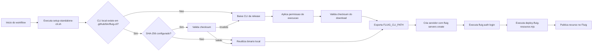

# fluig-viagens-app

Projeto Fluig com pipeline de deploy automatizado via GitHub Actions usando um CLI standalone baixado de release do GitHub.

## Estrutura do projeto

```
fluig-viagens-app/
├── fluig.json                          # Configuração do projeto, do CLI e do deploy
├── package.json                        # Script de teste (node --test)
├── datasets/
│   └── ds_viagens_paises.js            # Dataset de países para uso em formulários de viagem
├── tests/
│   ├── helpers/                        # Mocks de globais Fluig e loader de scripts via vm
│   └── datasets/
│       └── ds_viagens_paises.test.js   # Testes unitários do dataset de países
├── events/                             # Eventos globais (vazio)
├── forms/                              # Formulários (vazio)
├── mechanisms/                         # Mecanismos customizados (vazio)
├── reports/                            # Relatórios (vazio)
├── wcm/
│   ├── layout/                         # Layouts de página (vazio)
│   └── widget/                         # Widgets (vazio)
├── workflow/
│   ├── diagrams/                       # Diagramas de processo (vazio)
│   ├── literals/                       # Literais de workflow (vazio)
│   └── scripts/                        # Scripts de workflow (vazio)
└── .github/
    ├── workflows/
    │   ├── fluig-deploy.yml            # Pipeline de deploy
    │   └── tests.yml                   # Pipeline de testes unitários
    └── scripts/
        ├── setup-standalone-cli.sh     # Baixa ou reutiliza o binário do Fluig CLI
        └── deploy-fluig-resource.mjs  # Autentica no servidor e publica os recursos
```

## Datasets

| Arquivo | Descrição |
|---|---|
| `ds_viagens_paises.js` | Lista de países com código ISO, nome e sigla para uso em seleções de destino |

## Testes unitários

Os scripts de dataset rodam nativamente no engine JavaScript do servidor Fluig, que injeta
globais como `DatasetBuilder` e `DatasetFieldType`. Para testá-los em Node.js sem um servidor
Fluig real, os testes carregam cada script em um sandbox (`node:vm`) com mocks dessas globais.

```
tests/
├── helpers/
│   ├── fluigMocks.js            # Mocks de DatasetBuilder e DatasetFieldType
│   └── loadDatasetScript.js     # Executa um script de dataset num sandbox isolado
└── datasets/
    └── ds_viagens_paises.test.js
```

Não há dependências externas: os testes usam o test runner nativo do Node.js (`node --test`).

### Rodando os testes

```bash
npm test
```

### Adicionando testes para um novo dataset

1. Crie o arquivo em `datasets/`.
2. Crie `tests/datasets/<nome_do_dataset>.test.js` usando `loadDatasetScript` para carregar o
   script e `sandbox.createDataset()` para obter o dataset mockado (`getColumns()`/`getRows()`).
3. Não coloque arquivos de teste dentro de `datasets/`: o deploy publica todo `.js` encontrado
   nesse diretório (ver `resources.dataset` em `fluig.json`).

## Visão geral do deploy

O fluxo de deploy funciona assim:

1. O workflow executa `.github/scripts/setup-standalone-cli.sh`.
2. O script tenta reutilizar o binário local em `.github/bin/fluig-cli`.
3. Se o binário não existir ou tiver checksum divergente, faz o download do asset configurado em `cli.downloadUrl`.
4. Quando `cli.sha256` estiver preenchido, o binário é validado antes do deploy.
5. O script `.github/scripts/deploy-fluig-resource.mjs` cria um servidor com `fluig servers create`.
6. O script autentica com `fluig auth login`.
7. O deploy executa o `commandTemplate` definido em `fluig.json` para cada arquivo encontrado.

### Diagrama de funcionamento



## Configuração do repositório

### Secrets obrigatórios

Configure em **Settings › Secrets and variables › Actions › Secrets**:

| Secret | Descrição |
|---|---|
| `FLUIG_BASE_URL` | URL base do servidor Fluig (ex.: `https://fluig.empresa.com`) |
| `FLUIG_USERNAME` | Usuário de autenticação no Fluig |
| `FLUIG_PASSWORD` | Senha de autenticação no Fluig |

### Variáveis de repositório (opcionais)

Configure em **Settings › Secrets and variables › Actions › Variables** para sobrescrever o `fluig.json`:

| Variável | Descrição |
|---|---|
| `FLUIG_SERVER_NAME` | Nome lógico do servidor no CLI |
| `FLUIG_CLI_DOWNLOAD_URL` | URL de download do binário do Fluig CLI |
| `FLUIG_CLI_SHA256` | Checksum SHA-256 esperado do binário |
| `FLUIG_DEPLOY_COMMAND_TEMPLATE` | Template do comando de deploy com placeholders `{{variavel}}` |

## fluig.json

Configuração atual do projeto:

```json
{
  "name": "fluig-viagens-app",
  "description": "Projeto de viagens com pipeline de deploy automatizado via GitHub Actions",
  "version": "1.0.0",
  "author": "TOTVS",
  "license": "MIT",
  "fluigVersion": "2.0.0",
  "type": "application",
  "cli": {
    "mode": "standalone",
    "downloadUrl": "https://github.com/cardevisi/fluig-viagens-app/releases/download/v1.0.0/fluig-cli-linux-x64",
    "sha256": "9bcd2734138bef264b596a6d6a071a887e9b9ea988db7ccb01139a338503cbc2",
    "serverName": "fluig-ci",
    "outputPath": ".github/bin/fluig-cli"
  },
  "resources": {
    "dataset": {
      "directory": "datasets",
      "extensions": [".js"]
    }
  },
  "deploy": {
    "defaultResourceType": "dataset",
    "commandTemplate": "export resource --projectPath {{projectRoot}} --resourceType {{resourceType}} --resourceName {{resourceName}} --serverName {{serverName}}"
  }
}
```

## Placeholders do commandTemplate

| Placeholder | Valor |
|---|---|
| `{{resource}}` | Caminho relativo do arquivo (ex.: `datasets/ds_viagens_paises.js`) |
| `{{resourceAbsolute}}` | Caminho absoluto do arquivo |
| `{{resourceName}}` | Nome do arquivo sem extensão (ex.: `ds_viagens_paises`) |
| `{{resourceType}}` | Tipo do recurso (ex.: `dataset`) |
| `{{projectRoot}}` | Caminho absoluto da raiz do repositório |
| `{{serverName}}` | Nome do servidor criado e autenticado pelo CLI |

## Comportamento do setup do CLI

O script `setup-standalone-cli.sh` segue um fluxo idempotente:

- Se o binário já existir em `cli.outputPath`, reutiliza o arquivo sem novo download.
- Se `cli.sha256` estiver configurado, valida o checksum antes de reutilizar.
- Se o arquivo existir mas com checksum divergente, faz o download novamente.
- `FLUIG_CLI_DOWNLOAD_URL` só é obrigatório quando o download for necessário.
- O binário em `.github/bin/fluig-cli` é cache local do workspace e **não deve ser versionado**.

> Adicione `.github/bin/` ao `.gitignore` para evitar que o binário seja commitado acidentalmente.

## Preparação do servidor

Antes de publicar qualquer recurso, o `deploy-fluig-resource.mjs` executa automaticamente:

```
fluig servers create --server-name <nome> --host <host> [--ssl] --port <porta> --username <user> --password <pass>
fluig auth login --server-name <nome> --username <user> --password <pass>
```

- `FLUIG_BASE_URL` é convertida automaticamente em `host`, `ssl` e `port`.
- O nome do servidor segue a prioridade: `FLUIG_SERVER_NAME` › `cli.serverName` em `fluig.json` › nome do projeto › `fluig-ci`.
- O `GITHUB_RUN_ID` é adicionado como sufixo ao nome do servidor para evitar colisões entre runs paralelas.
- Em `dry_run`, os comandos são exibidos no log sem executar e sem vazar a senha.

## Como usar

### Deploy manual

1. Acesse **Actions › Fluig Deploy › Run workflow**.
2. Selecione `resource_type = dataset`.
3. Opcionalmente informe `resource_path` com o caminho relativo de um único arquivo (ex.: `datasets/ds_viagens_paises.js`). Deixe vazio para publicar todos os datasets.
4. Marque `dry_run` para apenas visualizar os comandos sem executar o deploy.

### Deploy automático

Em qualquer `push` para `main` que altere arquivos em:

- `datasets/**`
- `fluig.json`
- `.github/workflows/fluig-deploy.yml`
- `.github/scripts/**`

O workflow dispara automaticamente e publica todos os arquivos de `datasets/`.

## Origem do CLI

- O binário Linux usado no pipeline é publicado como asset de release neste próprio repositório.
- A versão atual aponta para `v1.0.0` (`fluig-cli-linux-x64`).
- Ao publicar uma nova versão do CLI, atualize `cli.downloadUrl` e `cli.sha256` juntos em `fluig.json` ou nas repo variables.

## Boas práticas

- Não versione `.github/bin/fluig-cli`; adicione o caminho ao `.gitignore`.
- Mantenha `cli.sha256` preenchido para evitar uso de binários corrompidos ou substituídos.
- Use `cli.serverName` ou `FLUIG_SERVER_NAME` para padronizar o nome do servidor.
- Prefira publicar novas versões do CLI em releases em vez de commitar binários no repositório.
- Atualize sempre `downloadUrl` e `sha256` juntos ao trocar a versão do CLI.

