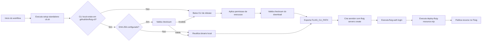

# fluig-viagens-app

Projeto Fluig com pipeline de deploy via GitHub Actions usando um CLI standalone baixado de release do GitHub.

## Estrutura

- `datasets/`: scripts de dataset a serem publicados
- `fluig.json`: configuracao do projeto, do CLI e do comando de deploy
- `.github/workflows/fluig-deploy.yml`: pipeline de deploy
- `.github/scripts/setup-standalone-cli.sh`: reutiliza ou baixa e prepara o binario standalone
- `.github/scripts/deploy-fluig-resource.mjs`: resolve os arquivos e executa o deploy

## Visao geral

O fluxo de deploy funciona assim:

1. O workflow executa o script `.github/scripts/setup-standalone-cli.sh`.
2. O script tenta reutilizar o binario local em `.github/bin/fluig-cli`.
3. Se o binario nao existir ou estiver invalido, o script baixa o asset configurado em `cli.downloadUrl`.
4. Quando `cli.sha256` estiver preenchido, o binario e validado antes do deploy.
5. O script de deploy cria um servidor do Fluig CLI com `fluig servers create`.
6. O script autentica no servidor com `fluig auth login`.
7. O workflow executa o export com base no `commandTemplate` definido em `fluig.json`.

### Diagrama de funcionamento



## Secrets obrigatorios

Configure no repositorio:

- `FLUIG_BASE_URL`
- `FLUIG_USERNAME`
- `FLUIG_PASSWORD`

## Variaveis opcionais

Voce pode sobrescrever a configuracao de `fluig.json` com repo variables:

- `FLUIG_SERVER_NAME`
- `FLUIG_CLI_DOWNLOAD_URL`
- `FLUIG_CLI_SHA256`
- `FLUIG_DEPLOY_COMMAND_TEMPLATE`

## Comportamento do setup do CLI

O script `.github/scripts/setup-standalone-cli.sh` segue um fluxo idempotente:

- se o binario ja existir em `cli.outputPath`, ele reutiliza o arquivo
- se `cli.sha256` estiver configurado, valida o checksum antes de reutilizar
- se o arquivo existir mas estiver invalido, faz o download novamente
- `FLUIG_CLI_DOWNLOAD_URL` so e obrigatorio quando o download realmente for necessario
- o binario em `.github/bin/fluig-cli` e cache local do workspace e nao deve ser versionado

## Preparacao do servidor

Antes de publicar qualquer recurso, o script `.github/scripts/deploy-fluig-resource.mjs` executa automaticamente:

- `fluig servers create --server-name ... --host ... --ssl ... --port ... --username ... --password ...`
- `fluig auth login --server-name ... --username ... --password ...`

Detalhes do fluxo:

- `FLUIG_BASE_URL` e convertida automaticamente em `host`, `ssl` e `port`
- `FLUIG_SERVER_NAME` pode sobrescrever o nome do servidor; se nao for informado, o valor de `cli.serverName` e usado
- as credenciais sao lidas de `FLUIG_USERNAME` e `FLUIG_PASSWORD`
- em `dry_run`, os comandos sao exibidos sem vazar a senha

## Origem do CLI

- o binario Linux usado no pipeline e publicado como asset de release no GitHub
- a URL padrao atual aponta para `v1.0.0` do proprio repositorio
- a melhor pratica e manter `downloadUrl` e `sha256` sempre versionados juntos
- se uma nova versao do CLI for publicada, atualize os dois campos em `fluig.json` ou nas repo variables

## Tipos suportados pelo CLI

O comando `fluig export resource` suporta os tipos:

- `dataset`
- `form`
- `widget`
- `layout`
- `events`
- `reports`

Observacao:

- para `widget` e `layout`, o CLI gera o `.war` automaticamente na pasta `target` antes do envio

## fluig.json

Exemplo:

```json
{
  "projectName": "fluig-viagens-app",
  "cli": {
    "mode": "standalone",
    "downloadUrl": "https://github.com/cardevisi/fluig-viagens-app/releases/download/v1.0.0/fluig-cli-linux-x64",
    "sha256": "9bcd2734138bef264b596a6d6a071a887e9b9ea988db7ccb01139a338503cbc2",
    "serverName": "fluig-ci",
    "outputPath": ".github/bin/fluig-cli"
  },
  "resources": {
    "dataset": {
      "directory": "datasets",
      "extensions": [".js"]
    }
  },
  "deploy": {
    "defaultResourceType": "dataset",
    "commandTemplate": "export resource --projectPath {{projectRoot}} --resourceType {{resourceType}} --resourceName {{resourceName}} --serverName {{serverName}}"
  }
}
```

## Placeholders do comando

O `commandTemplate` aceita:

- `{{resource}}`: caminho relativo do arquivo
- `{{resourceAbsolute}}`: caminho absoluto do arquivo
- `{{resourceName}}`: nome do recurso sem extensao
- `{{resourceType}}`: tipo do recurso, como `dataset`
- `{{projectRoot}}`: raiz do repositorio
- `{{serverName}}`: nome do servidor criado e autenticado pelo CLI

## Boas praticas

- nao versione `/.github/bin/fluig-cli`; esse arquivo deve existir apenas como cache local
- mantenha `cli.sha256` preenchido para evitar uso de binarios corrompidos ou trocados
- use `cli.serverName` ou `FLUIG_SERVER_NAME` para padronizar o nome do servidor criado pelo CLI
- use `FLUIG_CLI_DOWNLOAD_URL` e `FLUIG_CLI_SHA256` apenas quando precisar sobrescrever o padrao do projeto
- prefira publicar novas versoes do CLI em releases em vez de commitar binarios grandes no repositorio

## Como usar

Deploy manual pelo GitHub Actions:

1. Abra `Actions`.
2. Execute `Fluig Deploy`.
3. Informe `resource_type=dataset`.
4. Opcionalmente informe `resource_path=datasets/ds_viagens_exemplo.js`.

Em `push` para `main`, o workflow tenta publicar todos os arquivos de `datasets/`.
