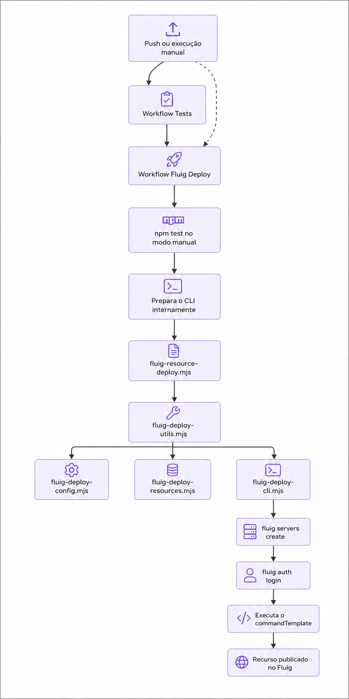

summary: Reconstrua do zero o projeto fluig-viagens-app — dataset, testes automatizados e pipeline de deploy com GitHub Actions.
id: reconstruindo-fluig-viagens-app
categories: Fluig, CI/CD, GitHub Actions
environments: web
tags: fluig, github-actions, nodejs, ci-cd, codelab
status: Published
authors: TOTVS - Fluig Studio
feedback link: https://github.com/totvs/fluig-viagens-app/issues

# Contribuindo com o fluig-viagens-app: dataset, testes e pipeline de deploy

## Visão geral
Duration: 0:03:00

Nesta aula você irá contribuir com um projeto Fluig real chamado **fluig-viagens-app**, onde irá
desenvolver um dataset responsável por fornecer os dados para o select de países, com testes
unitários em Node.js e um pipeline de GitHub Actions que fará o deploy automático no servidor
Fluig.

Ao longo do codelab, você vai criar e testar esse dataset, organizar a automação de testes e
entender como o deploy é executado com o Fluig CLI dentro do pipeline.

> aside positive
> Muitos dos conteúdos deste codelab foram preparados para **copiar e colar** direto no terminal
> ou no editor. Para facilitar o uso do botão de cópia, os comandos aparecem em blocos com
> linguagem explícita e sem prefixos como `$` ou `%`.

### Atividades deste laboratório

- Clonar um projeto base já preparado para a aula.
- Completar os arquivos principais colando trechos de código guiados.
- Desenvolver um dataset Fluig para listar países.
- Testar o dataset fora do servidor usando `node --test`.
- Configurar o workflow de testes contínuos.
- Entender o fluxo de deploy com o Fluig CLI e validar a execução em `dry_run`.

### O que você vai aprender

- Como escrever um dataset Fluig simples e reutilizável.
- Como simular globais do Fluig para rodar testes localmente.
- Como conduzir a implementação com blocos reais de copiar e colar.
- Como organizar um pipeline de testes que protege a branch `main`.
- Como separar o deploy em fluxo principal e módulos menores por responsabilidade.
- Como o GitHub Actions orquestra testes, autenticação e publicação de recursos.

### O que você vai construir

```text
fluig-viagens-app/
├── fluig.json                          # Configuração do projeto, do CLI e do deploy
├── package.json                        # Script de teste (node --test)
├── .gitignore
├── datasets/
│   └── ds-viagens-paises.js            # Dataset de países para uso em formulários de viagem
├── tests/
│   ├── helpers/                        # Mocks de globais Fluig e loader de scripts via vm
│   └── datasets/
│       └── ds-viagens-paises.test.js   # Testes unitários do dataset de países
├── events/ forms/ mechanisms/ reports/ # Pastas de recursos (vazias por enquanto)
├── wcm/layout/ wcm/widget/
├── workflow/diagrams/ workflow/literals/ workflow/scripts/
└── .github/
    ├── workflows/
    │   ├── fluig-tests.yml             # Pipeline de testes unitários
    │   └── fluig-deploy.yml            # Pipeline de deploy
    └── scripts/
        ├── setup-standalone-cli.sh     # Usado internamente pelo workflow
        ├── fluig-deploy-config.mjs     # Leitura de config e validação de ambiente
        ├── fluig-deploy-resources.mjs  # Descoberta de arquivos e nome lógico do recurso
        ├── fluig-deploy-cli.mjs        # Autenticação, comandos e execução do CLI
        ├── fluig-deploy-utils.mjs      # Fachada de compatibilidade para os módulos
        └── fluig-resource-deploy.mjs   # Mantém visível o fluxo principal do CLI
```

## Pré-requisitos
Duration: 0:03:00

Verifique cada item abaixo antes de começar. Cole os comandos no seu terminal.

1. **Node.js 20 ou superior** (o projeto usa o test runner nativo do Node):

```bash
node --version
```

2. **Git** instalado e configurado:

```bash
git --version
```

3. Uma conta no **GitHub** (para criar o repositório remoto e os pipelines).

> aside negative
> Você **não precisa** de um servidor Fluig real para concluir este codelab. O pipeline de
> deploy será testado em modo `dry_run`, que apenas exibe os comandos sem executar nada em um
> servidor de verdade. Se você tiver acesso a um ambiente Fluig, poderá usá-lo no último passo.

## Clone o projeto no GitHub
Duration: 0:03:00

Se o repositório já existir no GitHub, o primeiro passo é clonar esse projeto para a sua máquina.
No exemplo abaixo, usamos a URL SSH do repositório:

Repositório: <https://github.com/cardevisi/fluig-viagens-app>

```bash
git clone git@github.com:cardevisi/fluig-viagens-app.git
cd fluig-viagens-app
```


> aside positive
> Se você já configurou sua chave SSH no GitHub, esse formato `git@github.com:...` costuma ser o
> mais prático para trabalhar no dia a dia.

## Fluxo do deploy
Duration: 0:03:00

Antes de entrar nos arquivos, vale ver o fluxo completo do deploy em uma visão mais alta. A ideia
é enxergar primeiro a sequência principal e depois detalhar cada parte ao longo da aula.

<!-- Diagrama Mermaid original substituido por imagem para a visualizacao do codelab. -->



No fluxo automatico, o deploy so continua depois que o workflow `Tests` termina com sucesso na
branch `main`. No fluxo manual, o proprio workflow de deploy executa o `npm test` antes de seguir.

## package.json: confira o comando de teste
Duration: 0:02:00

Neste codelab, o projeto base já vem pronto. Aqui o objetivo é apenas conferir o comando de teste
que a turma vai usar durante a aula.

```json
{
  "name": "fluig-viagens-app",
  "version": "1.0.0",
  "private": true,
  "description": "Projeto de viagens com pipeline de deploy automatizado via GitHub Actions",
  "scripts": {
    "test": "node --test"
  },
  "engines": {
    "node": ">=20"
  }
}
```

Repare que **não há dependências externas**: `node --test` é o test runner nativo do Node.js
(disponível desde a versão 18+), então não é preciso instalar bibliotecas extras para rodar os
testes.

## fluig.json: configuração central do projeto
Duration: 0:05:00

O `fluig.json` é o arquivo que descreve o projeto e como fazer o deploy dos recursos. É a peça
central que os scripts de CI vão ler.

```json
{
  "name": "fluig-viagens-app",
  "description": "Projeto de viagens com pipeline de deploy automatizado via GitHub Actions",
  "version": "1.0.0",
  "author": "TOTVS",
  "license": "MIT",
  "fluigVersion": "2.0.0",
  "type": "application",
  "cli": {
    "mode": "standalone",
    "downloadUrl": "https://github.com/SEU_USUARIO/fluig-viagens-app/releases/download/v1.0.0/fluig-cli-linux-x64",
    "sha256": "",
    "serverName": "fluig-ci",
    "outputPath": ".github/bin/fluig-cli"
  },
  "resources": {
    "dataset": {
      "directory": "datasets",
      "extensions": [".js"]
    }
  },
  "deploy": {
    "defaultResourceType": "dataset",
    "commandTemplate": "export resource --projectPath {{projectRoot}} --resourceType {{resourceType}} --resourceName {{resourceName}} --serverName {{serverName}}"
  }
}
```

> aside negative
> Substitua `SEU_USUARIO` pelo seu usuário/organização do GitHub. Deixamos `sha256` vazio de
> propósito: sem um valor configurado, o pipeline reaproveita o binário local sem validar o
> checksum. Preencha esse campo assim que publicar uma release real do CLI na sua esteira.

### Entendendo cada bloco

| Chave | Para que serve |
|---|---|
| `cli.mode` | `standalone` = o CLI é baixado como binário, sem instalação via npm |
| `cli.downloadUrl` | URL do asset de release do GitHub de onde o binário é baixado |
| `cli.sha256` | Checksum esperado do binário, para validar integridade (opcional) |
| `cli.serverName` | Nome lógico do servidor que o CLI vai registrar |
| `cli.outputPath` | Onde o binário baixado é salvo localmente (cache do workspace) |
| `resources.dataset.directory` | Pasta varrida em busca de recursos do tipo `dataset` |
| `deploy.commandTemplate` | Comando executado para cada recurso encontrado, com placeholders |

### Placeholders do `commandTemplate`

| Placeholder | Valor |
|---|---|
| `{{resource}}` | Caminho relativo do arquivo (ex.: `datasets/ds-viagens-paises.js`) |
| `{{resourceAbsolute}}` | Caminho absoluto do arquivo |
| `{{resourceName}}` | Nome lógico enviado ao CLI, com hífens convertidos para `_` (ex.: `ds_viagens_paises`) |
| `{{resourceType}}` | Tipo do recurso (ex.: `dataset`) |
| `{{projectRoot}}` | Caminho absoluto da raiz do repositório |
| `{{serverName}}` | Nome do servidor criado e autenticado pelo CLI |

## Dataset de países
Duration: 0:08:00

Abra o arquivo `datasets/ds-viagens-paises.js`. O projeto base já traz a estrutura pronta e neste
passo a ideia é colar os trechos que faltam para o dataset funcionar corretamente.

Scripts de dataset do Fluig rodam no engine JavaScript do servidor, que injeta globais como
`DatasetBuilder` e `DatasetFieldType` automaticamente — você não precisa importar nada.

### Trecho 1: colunas do dataset

Cole este bloco logo depois de `var dataset = DatasetBuilder.newDataset();`:

```javascript
// Define as colunas do dataset
dataset.addColumn("codigo", DatasetFieldType.STRING);
dataset.addColumn("nome", DatasetFieldType.STRING);
dataset.addColumn("sigla", DatasetFieldType.STRING);
```

### Trecho 2: lista inicial de países

Cole este bloco no lugar da lista vazia de `paises`:

```javascript
var paises = [
  { codigo: "BRA", nome: "Brasil", sigla: "BR" },
  { codigo: "USA", nome: "Estados Unidos", sigla: "US" },
  { codigo: "ARG", nome: "Argentina", sigla: "AR" },
  { codigo: "CHL", nome: "Chile", sigla: "CL" },
  { codigo: "URY", nome: "Uruguai", sigla: "UY" },
  { codigo: "PRY", nome: "Paraguai", sigla: "PY" },
  { codigo: "BOL", nome: "Bolívia", sigla: "BO" },
  { codigo: "PER", nome: "Peru", sigla: "PE" },
  { codigo: "COL", nome: "Colômbia", sigla: "CO" },
  { codigo: "VEN", nome: "Venezuela", sigla: "VE" },
  { codigo: "MEX", nome: "México", sigla: "MX" },
  { codigo: "DEU", nome: "Alemanha", sigla: "DE" },
  { codigo: "ESP", nome: "Espanha", sigla: "ES" },
  { codigo: "PRT", nome: "Portugal", sigla: "PT" },
  { codigo: "FRA", nome: "França", sigla: "FR" },
  { codigo: "ITA", nome: "Itália", sigla: "IT" },
  { codigo: "GBR", nome: "Reino Unido", sigla: "GB" },
  { codigo: "JPN", nome: "Japão", sigla: "JP" },
  { codigo: "CHN", nome: "China", sigla: "CN" },
  { codigo: "AUS", nome: "Austrália", sigla: "AU" },
];
```

### Trecho 3: adicionando as linhas do dataset

Cole este bloco antes do `return dataset;`:

```javascript
// Adiciona cada país como uma linha no dataset
for (var i = 0; i < paises.length; i++) {
  var pais = paises[i];
  dataset.addRow([pais.codigo, pais.nome, pais.sigla]);
}

console.log("Dataset de países criado com sucesso. Total de países: " + paises.length);
console.log("Exemplo de país: " + JSON.stringify(paises[0]));
```

> aside positive
> `createDataset()` segue o contrato esperado pelo runtime do Fluig: uma função que devolve um
> objeto `dataset` construído via `DatasetBuilder`. É essa mesma função que os testes do próximo
> passo vão chamar diretamente.

## Testes unitários do dataset
Duration: 0:08:00

Como o `DatasetBuilder`/`DatasetFieldType` só existem dentro do servidor Fluig, para testar em
Node.js criamos **mocks** dessas globais e carregamos o script de dataset em um sandbox isolado
(`node:vm`), sem precisar de um servidor Fluig real.

> aside positive
> Os arquivos auxiliares `tests/helpers/fluig-mocks.js` e
> `tests/helpers/load-dataset-script.js` já estarão prontos no projeto base. Na aula, o foco será
> completar apenas o teste principal do dataset.

### Teste do dataset de países

Abra o arquivo `tests/datasets/ds-viagens-paises.test.js` e cole os trechos abaixo nos testes
correspondentes.

### Trecho 1: colunas esperadas

Cole este conteúdo dentro do teste `define as colunas codigo, nome e sigla como STRING`:

```javascript
assert.deepEqual(
  columns.map((column) => column.name),
  ["codigo", "nome", "sigla"]
);
assert.equal(
  columns.every((column) => column.type === "STRING"),
  true
);
```

### Trecho 2: quantidade de países

Cole este trecho dentro do teste `retorna 20 países`:

```javascript
assert.equal(rows.length, 20);
```

### Trecho 3: cada linha do dataset

Cole este trecho dentro do teste `cada linha possui codigo, nome e sigla preenchidos`:

```javascript
for (const row of rows) {
  assert.equal(row.length, 3);
  for (const value of row) {
    assert.equal(typeof value, "string");
    assert.notEqual(value.trim(), "");
  }
}
```

### Trecho 4: dados do Brasil

Cole este trecho dentro do teste `inclui o Brasil com os dados corretos`:

```javascript
const brasil = rows.find((row) => row[0] === "BRA");
assert.deepEqual(Array.from(brasil), ["BRA", "Brasil", "BR"]);
```

### Trecho 5: códigos sem duplicidade

Cole este trecho dentro do teste `não possui códigos de país duplicados`:

```javascript
const codigos = rows.map((row) => row[0]);
assert.equal(new Set(codigos).size, codigos.length);
```

### Rode os testes localmente

```bash
npm test
```

Você deve ver 5 sub-testes passando (colunas, quantidade de linhas, campos preenchidos, dados do
Brasil e ausência de duplicados).

> aside negative
> Nunca crie arquivos de teste dentro de `datasets/`. O deploy publica **todo `.js`** encontrado
> nessa pasta (veja `resources.dataset` no `fluig.json`), então um teste ali seria publicado como
> se fosse um dataset.

## Pipeline de testes contínuos (fluig-tests.yml)
Duration: 0:05:00

Esse workflow roda os testes automaticamente em pull requests e em pushes para qualquer branch
relevante, inclusive a `main`. Assim, o deploy automático pode ouvir a conclusão desse workflow e
só publicar recursos quando os testes terminarem com sucesso.

Abra o arquivo `.github/workflows/fluig-tests.yml` e complete os pontos abaixo.

### Trecho 1: caminhos monitorados no `push`

Cole este bloco dentro de `on.push.paths`:

```yaml
- "datasets/**"
- "tests/**"
- "fluig.json"
- ".github/scripts/**"
- ".github/workflows/**"
- "package.json"
```

### Trecho 2: caminhos monitorados no `pull_request`

Cole o mesmo bloco dentro de `on.pull_request.paths`:

```yaml
- "datasets/**"
- "tests/**"
- "fluig.json"
- ".github/scripts/**"
- ".github/workflows/**"
- "package.json"
```

### Trecho 3: comando do step de testes

Cole este comando no step `Run dataset unit tests`:

```yaml
run: npm test
```

> aside positive
> Repare nos filtros `paths`: o workflow só dispara quando arquivos relevantes mudam
> (`datasets/**`, `tests/**`, `fluig.json`, scripts e workflows), evitando execuções
> desnecessárias em commits que não afetam o código testado.

## Script principal do deploy
Duration: 0:06:00

Este é o pipeline mais importante do projeto: ele prepara o CLI nos bastidores, autentica em um
servidor Fluig e publica os recursos (datasets, por enquanto). Para a aula, vamos começar pelo
script principal que orquestra o deploy.

### 1. Arquivos auxiliares já preparados

No projeto base, estes arquivos já estarão completos:

- `.github/scripts/fluig-deploy-config.mjs`
- `.github/scripts/fluig-deploy-resources.mjs`
- `.github/scripts/fluig-deploy-cli.mjs`
- `.github/scripts/fluig-deploy-utils.mjs`

Assim a turma consegue focar na história principal do deploy, sem se perder nos detalhes de apoio.

### 2. Complete o script principal do deploy

Abra o arquivo `.github/scripts/fluig-resource-deploy.mjs` e cole os trechos abaixo nos pontos
indicados pela estrutura base.

### Trecho 1: validação e leitura da configuração

Cole este bloco logo depois de `const dryRunEnabled = isDryRunEnabled();`:

```javascript
ensureRequiredDeployEnvironment({ dryRunEnabled });

const resourceType = getSelectedResourceType({ fluigProjectConfig });
const resourceSettings = getResourceSettings({
  fluigProjectConfig,
  resourceType,
});
const cliBinaryPath = resolveFluigCliBinaryPath({
  workspaceRootDir,
  fluigProjectConfig,
});
const deployCommandTemplate = resolveDeployCommandTemplate({
  fluigProjectConfig,
});
const resourceFiles = await listResourceFilesForDeploy({
  workspaceRootDir,
  resourceSettings,
});
```

### Trecho 2: autenticação do CLI

Cole este bloco depois de `printDeploySummary(...)`:

```javascript
await authenticateFluigCli({
  cliBinaryPath,
  fluigServerConnection,
  dryRunEnabled,
  workingDirectory: workspaceRootDir,
});
```

### Trecho 3: montagem do comando de deploy

Cole este bloco dentro do `for (const resourcePath of resourceFiles)`:

```javascript
const deployCommand = createResourceDeployCommand({
  cliBinaryPath,
  deployCommandTemplate,
  resourcePath,
  resourceType,
  workspaceRootDir,
  cliServerName: fluigServerConnection.serverName,
});
```

## Pipeline de deploy contínuo (fluig-deploy.yml)
Duration: 0:06:00

Agora que o script principal já está pronto, o próximo passo é montar o workflow de deploy no
mesmo estilo que fizemos no workflow de testes.

### Complete o workflow que orquestra o deploy

Abra o arquivo `.github/workflows/fluig-deploy.yml` e complete os blocos abaixo.

### Trecho 1: workflow observado pelo `workflow_run`

Cole este bloco dentro de `on.workflow_run`:

```yaml
workflows:
  - Tests
types:
  - completed
```

### Trecho 2: condição do job `deploy`

Cole esta condição na chave `if` do job:

```yaml
if: >
  github.event_name == 'workflow_dispatch' ||
  (
    github.event_name == 'workflow_run' &&
    github.event.workflow_run.conclusion == 'success' &&
    github.event.workflow_run.head_branch == 'main'
  )
```

### Trecho 3: checkout da referência correta

Cole este bloco dentro do step `Checkout`:

```yaml
with:
  ref: ${{ github.event_name == 'workflow_run' && github.event.workflow_run.head_sha || github.sha }}
```

### Trecho 4: comando de teste no disparo manual

Cole este bloco no step `Run dataset unit tests`:

```yaml
if: github.event_name == 'workflow_dispatch'
run: npm test
```

### Trecho 5: preparação do CLI standalone

Cole este comando no step `standalone`:

```yaml
run: bash .github/scripts/setup-standalone-cli.sh
```

### Trecho 6: execução do deploy

Cole este comando no step `Execute Fluig deploy`:

```yaml
run: node .github/scripts/fluig-resource-deploy.mjs
```

> aside positive
> O fluxo automático ficou mais simples de explicar em aula: `Tests` valida primeiro e
> `Fluig Deploy` só roda depois, via `workflow_run`. No modo manual, o próprio workflow
> de deploy executa `npm test` antes de publicar. A preparação do CLI fica escondida dentro do
> workflow e não precisa virar tópico da explicação.

## Secrets, Variables e primeira execução
Duration: 0:05:00

### Confira o repositório no GitHub

Neste treinamento, o repositório base já estará pronto no GitHub. Antes de começar a execução,
confirme apenas se:

1. o repositório correto foi clonado;
2. a branch usada na aula é a `main`;
3. a aba **Actions** está habilitada no projeto.

### Configure os Secrets (dados sensíveis)

No GitHub, acesse **Settings › Secrets and variables › Actions › Secrets** e crie:

| Secret | Descrição |
|---|---|
| `FLUIG_BASE_URL` | URL base do servidor Fluig (ex.: `https://fluig.empresa.com`) |
| `FLUIG_USERNAME` | Usuário de autenticação no Fluig |
| `FLUIG_PASSWORD` | Senha de autenticação no Fluig |

> aside negative
> Nunca coloque essas credenciais direto no `fluig.json` ou em qualquer arquivo versionado.
> Secrets do GitHub Actions são criptografados e nunca aparecem nos logs.

### Configure as Variables (dados não sensíveis, opcionais)

Em **Settings › Secrets and variables › Actions › Variables**, você pode sobrescrever o que
está no `fluig.json`:

| Variável | Descrição |
|---|---|
| `FLUIG_SERVER_NAME` | Nome lógico do servidor no CLI |
| `FLUIG_CLI_DOWNLOAD_URL` | URL de download do binário do Fluig CLI |
| `FLUIG_CLI_SHA256` | Checksum SHA-256 esperado do binário |
| `FLUIG_DEPLOY_COMMAND_TEMPLATE` | Template do comando de deploy |

### Rode o pipeline em modo `dry_run`

1. Acesse a aba **Actions** do repositório.
2. Selecione o workflow **Fluig Deploy** → **Run workflow**.
3. Deixe `resource_type = dataset`, `resource_path` vazio e marque `dry_run = true`.
4. Clique em **Run workflow** e acompanhe o log do job `deploy`.

Você verá os comandos do Fluig CLI sendo exibidos (com a senha oculta como `***`), mas nada será
executado de verdade — é a forma segura de validar toda a esteira sem precisar de um servidor
Fluig real.

> aside positive
> Se você tiver acesso a um servidor Fluig de testes, preencha os secrets com as credenciais
> reais, gere um binário do CLI, publique-o como release no GitHub, atualize `cli.downloadUrl` e
> `cli.sha256` no `fluig.json` e rode novamente com `dry_run = false` para publicar o dataset de
> verdade.

## Parabéns e próximos passos
Duration: 0:03:00

Você completou os principais trechos do **fluig-viagens-app** e agora entende:

- Como um dataset Fluig é escrito e como testá-lo fora do servidor com `node:vm`.
- Como o `fluig.json` centraliza a configuração do CLI, dos recursos e do deploy.
- Como funciona um pipeline de testes (`fluig-tests.yml`) que protege a branch `main`.
- Como funciona um pipeline de deploy (`fluig-deploy.yml`) que autentica no servidor e publica
  recursos automaticamente.

### Para continuar praticando

- Adicione um novo dataset em `datasets/` e o respectivo teste em `tests/datasets/`.
- Experimente rodar o workflow com `resource_path` apontando para um único arquivo.
- Explore os diretórios `forms/`, `wcm/widget/` e `workflow/scripts/` para expandir o projeto
  além dos datasets.

### Referências

- Repositório de referência: <https://github.com/cardevisi/fluig-viagens-app>
- Material do codelab: [docs/codelab-fluig-viagens-app.md](docs/codelab-fluig-viagens-app.md)
- [README.md](../README.md) do projeto original, com detalhes adicionais da implementação.
