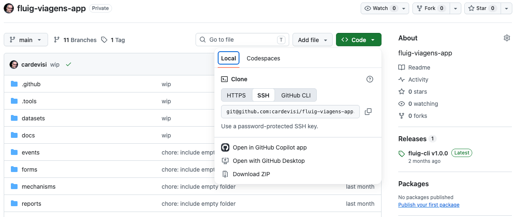
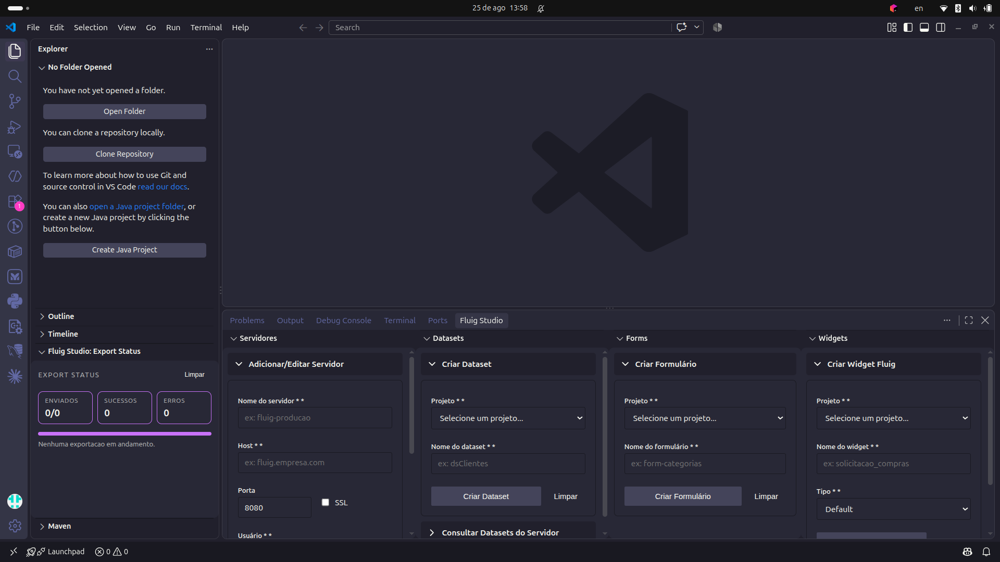
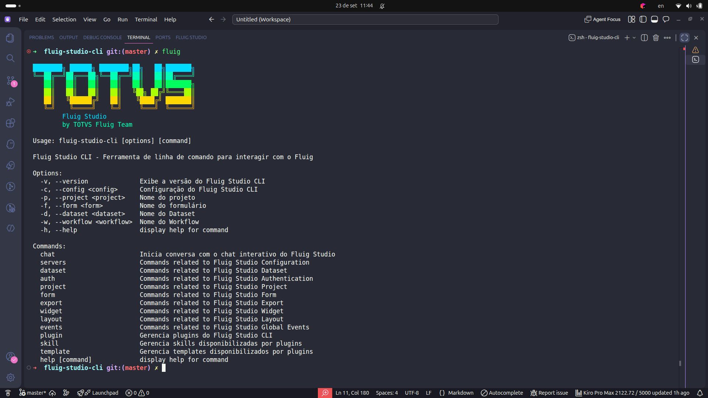

summary: Reconstrua do zero o projeto fluig-viagens-app-min com dataset, teste de contrato e pipeline CI/CD simplificado.
id: reconstruindo-fluig-viagens-app
categories: Fluig, CI/CD, GitHub Actions
environments: web
tags: fluig, github-actions, nodejs, ci-cd, codelab
status: Published
authors: TOTVS - Fluig Studio
feedback link: https://github.com/cardevisi/fluig-viagens-app-min/issues

# Reconstruindo o fluig-viagens-app-min: dataset, teste de contrato e pipeline simplificado

## Visão geral
Duration: 0:03:00

Neste codelab, você vai reconstruir o projeto **fluig-viagens-app-min**, acompanhando um fluxo de desenvolvimento que se aproxima de times que precisam publicar com mais segurança e qualidade.
Ao longo da aula, você vai entender como combinar implementação, testes automatizados e pipeline de CI/CD para criar uma camada de qualidade antes do envio de recursos para produção. Em vez de focar apenas no código do dataset, a proposta é mostrar o caminho completo: desenvolver, validar, automatizar e preparar a publicação em um servidor Fluig remoto com o apoio do GitHub Actions.

Ao final, você terá um projeto que:

- publica apenas datasets alterados;
- valida o dataset com teste automatizado;
- usa uma imagem Docker pronta com o Fluig CLI no GHCR (GitHub Container Registry);
- executa deploy manual ou automático a partir do mesmo arquivo `fluig-deploy.yml`.

> aside positive
> Este projeto foi reduzido ao essencial para que a aula seja mais objetiva e fácil de acompanhar.
> Ao mesmo tempo, a estrutura apresentada aqui pode servir como base para cenários mais próximos do dia a dia, com evoluções como workflows separados, múltiplos ambientes e estratégias de publicação para desenvolvimento, homologação e produção.

### Atividades deste laboratório

- Clonar o repositório base.
- Ver rapidamente a extensão do VS Code usada no ecossistema Fluig.
- Ver o Fluig CLI em funcionamento com um overview dos principais comandos.
- Entender a estrutura mínima do projeto.
- Conferir o dataset `ds-viagens-paises.js`.
- Validar o teste de contrato com `npm test`.
- Ler o workflow `.github/workflows/fluig-deploy.yml`.
- Entender como o deploy roda dentro do container usando o Fluig CLI na imagem `ghcr.io/cardevisi/fluig-cli:0.1.0`.

### O que você vai aprender

- Como escrever um dataset Fluig simples.
- Como simular o ambiente do Fluig no Node.js para testar datasets localmente com `node:vm`.
- Como detectar datasets alterados no GitHub Actions.
- Como encapsular o Fluig CLI em Docker para manter o pipeline limpo.
- Como usar um workflow único para teste e deploy.

### O que você vai construir

```text
fluig-viagens-app-min/
├── datasets/
│   └── ds-viagens-paises.js
├── tests/
│   └── datasets.contract.test.js
├── .github/
│   ├── docker/
│   │   └── fluig-cli/
│   │       └── Dockerfile
│   ├── scripts/
│   │   └── fluig-resource-deploy.mjs
│   └── workflows/
│       └── fluig-deploy.yml
├── docs/
│   └── codelab-fluig-viagens-app.md
├── fluig.json
└── package.json
```

## Pré-requisitos
Duration: 0:03:00

Você vai precisar de:

1. **Node.js 20 ou superior**

```bash
node --version
```

2. **Git**

```bash
git --version
```

3. Uma conta no **GitHub**


4. Acesso a um ambiente Fluig apenas se quiser executar o deploy real.

> aside positive
> O pipeline foi desenhado para que a parte de teste possa ser estudada mesmo sem acesso imediato
> a um servidor Fluig.

## Clone o projeto
Duration: 0:02:00

O repositório usado nesta aula é:

<https://github.com/cardevisi/fluig-viagens-app-min>

Depois de acessar o repositório no GitHub, execute o clone localmente:

```bash
git clone git@github.com:cardevisi/fluig-viagens-app-min.git
cd fluig-viagens-app-min
```



## Demonstração rápida: Extensão VS Code
Duration: 0:02:00

Antes de iniciarmos a implementação, vamos conhecer a nova extensão para VS Code para desenvolvimento no Fluig. Uma visão geral das principais funcionalidades que poderão ser utilizadas no seu dia a dia.



Principais recursos da extensão VS Code para Fluig:

- Criação de projetos, datasets, formulários, widgets e layouts;
- Criação e gerenciamento de ambientes (Por exemplo: dev, homologação, produção);
- Criação e gerenciamento de recursos Fluig;
- Recursos que ajudam na produtividade durante o desenvolvimento;
- Integração com o restante do fluxo que vamos explorar ao longo da aula.
- MCP no Fluig CLI para automação de operações e desenvolvimento assistido por IA.

> aside positive
> A extensão do VS Code segue em desenvolvimento, e novas versões trarão mais recursos e melhorias.

## Demonstração rápida: Novo Fluig CLI e MCP
Duration: 0:02:00

Com a visão geral da extensão, agora vamos olhar rapidamente o Fluig CLI em funcionamento. Esse
momento é importante para você perceber como a experiência de uso do Fluig CLI se conecta com a
automação que aparece mais adiante no pipeline.



Para essa demonstração, vamos utilizar uma sequência curta de comandos do Fluig CLI como exemplo:

```bash
fluig --help
fluig projects list
fluig servers list
```

Ao acompanhar o terminal, observe estes pontos:

- O CLI pode ser usado localmente para explorar comandos e operações do projeto;
- Ele também pode ser executado de forma automatizada no pipeline;
- A mesma lógica de automação reaparece no processo de deploy mostrado neste codelab.

> aside positive
> Esta demonstração é importante para que você perceba que o Fluig CLI pode ser usado tanto no seu
> ambiente local quanto na automação do projeto. Assim, fica mais fácil entender como os comandos
> vistos aqui também aparecem no pipeline de validação e deploy.

## Estrutura mínima do projeto
Duration: 0:03:00

A implementação mínima aqui demostrada tem foco em três blocos:

1. `datasets/`: onde ficam os datasets Fluig.
2. `tests/`: onde ficam os testes automatizados.
3. `.github/`: onde ficam Dockerfile, script de deploy e workflow.

Essa estrutura é suficiente para demonstrar como configurar uma esteira completa de desenvolvimento, com testes automatizados e pipeline de CI/CD. Mas você poderá expandir a estrutura de acordo com suas necessidades.

## package.json: comando de teste
Duration: 0:02:00

O `package.json` atual tem apenas um comando de teste:

```json
{
  "name": "fluig-viagens-app",
  "version": "1.0.0",
  "private": true,
  "description": "Exemplo mínimo de testes e deploy de datasets Fluig",
  "scripts": {
    "test": "node --test"
  },
  "engines": {
    "node": ">=20"
  }
}
```

Com isso, basta rodar:

```bash
npm test
```

## fluig.json: configuração mínima do projeto
Duration: 0:03:00

O `fluig.json` é o arquivo que concentra os metadados e as configurações principais do projeto
Fluig. Em projetos maiores, ele pode reunir informações sobre o projeto, integrações com o CLI e
parâmetros usados em processos de automação. Em outras palavras, é um ponto central de
configuração que ajuda as ferramentas do ecossistema a entenderem como o projeto deve ser lido e
executado.

No modelo atual, o `fluig.json` guarda apenas o essencial para o script de deploy:

```json
{
  "name": "fluig-viagens-app",
  "description": "Projeto de viagens com dataset e teste de contrato",
  "version": "1.0.0",
  "author": "Carlos Oliveira",
  "license": "UNLICENSED",
  "cli": {
    "serverName": "fluig-ci"
  }
}
```

### O que cada campo faz

| Chave | Função |
|---|---|
| `name` | Nome lógico do projeto |
| `description` | Descreve de forma resumida o objetivo do projeto |
| `version` | Indica a versão atual do projeto |
| `author` | Identifica quem mantém ou publicou o projeto |
| `license` | Define o tipo de licença associado ao projeto |
| `cli.serverName` | Nome base usado pelo script para criar o servidor no Fluig CLI |

> aside positive
> Para você que está acompanhando a aula, o ponto principal aqui é: o pipeline já usa uma imagem
> Docker pronta com o Fluig CLI configurado. Isso reduz a quantidade de passos no processo e
> facilita o entendimento do que realmente importa no deploy.

## Dataset de países
Duration: 0:06:00

Abra `datasets/ds-viagens-paises.js`. O dataset atual já está pronto e usa a assinatura padrão do
Fluig: a função `createDataset(fields, constraints, sortFields)` devolve um objeto montado com `DatasetBuilder`.

Na prática, esses parâmetros representam:

- `fields`: as colunas solicitadas pela consulta;
- `constraints`: os filtros recebidos na chamada do dataset;
- `sortFields`: os campos pedidos para ordenação.

Neste exemplo, eles aparecem para respeitar o contrato do Fluig, mesmo sem influenciarem o retorno,
porque o dataset devolve sempre a mesma lista fixa de países.

```javascript
function createDataset(fields, constraints, sortFields) {
  // Assinatura padrão de datasets no Fluig:
  // - fields: colunas solicitadas pela consulta
  // - constraints: filtros recebidos na chamada
  // - sortFields: campos pedidos para ordenação
  void fields;
  void constraints;
  void sortFields;

  var ds = DatasetBuilder.newDataset();
  var rows = [
    ["BRA", "Brasil", "BR"],
    ["USA", "Estados Unidos", "US"],
    ["ARG", "Argentina", "AR"],
    ["CHL", "Chile", "CL"],
    ["URY", "Uruguai", "UY"],
    ["PRY", "Paraguai", "PY"],
    ["BOL", "Bolívia", "BO"],
    ["PER", "Peru", "PE"],
    ["COL", "Colômbia", "CO"],
    ["VEN", "Venezuela", "VE"],
    ["MEX", "México", "MX"],
    ["DEU", "Alemanha", "DE"],
    ["ESP", "Espanha", "ES"],
    ["PRT", "Portugal", "PT"],
    ["FRA", "França", "FR"],
    ["ITA", "Itália", "IT"],
    ["GBR", "Reino Unido", "GB"],
    ["JPN", "Japão", "JP"],
    ["CHN", "China", "CN"],
    ["AUS", "Austrália", "AU"],
  ];

  ds.addColumn("codigo", DatasetFieldType.STRING);
  ds.addColumn("nome", DatasetFieldType.STRING);
  ds.addColumn("sigla", DatasetFieldType.STRING);

  for (var i = 0; i < rows.length; i++) {
    ds.addRow(rows[i]);
  }

  return ds;
}
```

### O que observar

- O dataset tem 3 colunas: `codigo`, `nome` e `sigla`.
- Cada linha é um array simples de strings.
- O script não depende de `require`, porque no Fluig as globais já existem no runtime.

## Teste de contrato
Duration: 0:07:00

Em vez de criar toda a estrutura de teste do zero para cada dataset, o projeto usa uma base
reaproveitável de validação:

`tests/datasets.contract.test.js`

Essa base concentra apenas o que pode ser compartilhado entre diferentes datasets. Ela faz quatro
coisas:

1. varre a pasta `datasets/`;
2. executa cada script dentro de um sandbox;
3. injeta mocks de `DatasetBuilder` e `DatasetFieldType`;
4. valida um contrato mínimo para todos os datasets.

Isso é útil porque futuros datasets podem ter estruturas e regras de negócio diferentes, mas ainda
assim continuarão precisando de algumas validações comuns, como carregamento do script, criação do
dataset e consistência entre colunas e linhas.

Trecho principal:

```javascript
const dataset = loadDataset(relativePath);
const columns = dataset.getColumns();
const rows = dataset.getRows();

assert.ok(Array.isArray(columns));
assert.ok(Array.isArray(rows));
assert.notEqual(columns.length, 0);

const columnNames = columns.map((column) => column.name);
assert.equal(new Set(columnNames).size, columnNames.length);

for (const row of rows) {
  assert.equal(row.length, columns.length);
}
```

Para o dataset `ds-viagens-paises.js`, o teste ainda faz validações específicas:

```javascript
if (relativePath === "datasets/ds-viagens-paises.js") {
  assert.deepEqual(columnNames, ["codigo", "nome", "sigla"]);
  assert.equal(rows.length, 20);
  assert.deepEqual(Array.from(rows.find((row) => row[0] === "BRA")), [
    "BRA",
    "Brasil",
    "BR",
  ]);
}
```

### Execute localmente

```bash
npm test
```

> aside positive
> Neste projeto, o teste compartilhado não tenta resolver tudo sozinho. Ele cuida apenas do que é
> reaproveitável entre datasets. Já as validações de conteúdo e de regra de negócio continuam sendo
> específicas de cada recurso, o que deixa a estratégia mais flexível para projetos reais.

## Workflow único de CI/CD
Duration: 0:08:00

O projeto agora usa apenas um workflow:

`/.github/workflows/fluig-deploy.yml`

Ele responde a:

- `push`
- `pull_request`
- `workflow_dispatch`

Os caminhos monitorados são:

```yaml
paths:
  - "datasets/**"
  - "tests/**"
  - ".github/**"
  - "fluig.json"
  - "package.json"
```

### Job de teste

O primeiro job é o `test`:

```yaml
test:
  runs-on: ubuntu-latest
  container:
    image: node:22-bookworm-slim

  steps:
    - name: Checkout
      uses: actions/checkout@v5

    - name: Rodar testes
      run: npm test
```

Esse job sempre vem antes do deploy.

### Job de deploy

O segundo job é o `deploy`, dependente do `test`:

```yaml
deploy:
  needs: test
  runs-on: ubuntu-latest
  if: >
    needs.test.result == 'success' &&
    (
      github.event_name == 'workflow_dispatch' ||
      (github.event_name == 'push' && github.ref == 'refs/heads/main')
    )
```

Ou seja:

- em `pull_request`, o workflow testa, mas não faz deploy;
- em `push` na `main`, ele testa e depois publica;
- em `workflow_dispatch`, o deploy pode ser disparado manualmente.

## Detectando apenas os datasets alterados
Duration: 0:05:00

O step `Descobrir datasets alterados` decide o que será publicado.

Quando a execução for manual, ele usa a entrada `dataset_paths`.
Quando a execução vier de `push`, ele calcula o diff entre commits:

```bash
BASE="${{ github.event.before }}"
if [[ -z "$BASE" || "$BASE" == "0000000000000000000000000000000000000000" ]]; then
  BASE="$(git rev-list --max-parents=0 HEAD | tail -n 1)"
fi

DATASETS="$(git diff --name-only "$BASE" "${GITHUB_SHA}" | grep '^datasets/.*\.js$' || true)"
```

Depois, a lista é enviada para `GITHUB_OUTPUT` como `steps.datasets.outputs.paths`.

Isso permite:

- fazer deploy apenas do que mudou;
- ou informar manualmente uma lista de datasets, um por linha.

## Imagem Docker do Fluig CLI
Duration: 0:04:00

O deploy não instala o Fluig CLI passo a passo no runner. Em vez disso, ele usa a imagem:

```text
ghcr.io/cardevisi/fluig-cli:0.1.0
```

O Dockerfile local que gera essa imagem fica em:

`/.github/docker/fluig-cli/Dockerfile`

Trecho principal:

```dockerfile
FROM node:22-bookworm-slim

ARG TARGETARCH

RUN case "${TARGETARCH}" in \
    "amd64") cp /tmp/fluig-standalone/fluig-cli-linux-x64 /usr/local/bin/fluig ;; \
    *) echo "Arquitetura suportada apenas para esta imagem: amd64. Recebido: ${TARGETARCH}" && exit 1 ;; \
  esac
```

### Por que isso importa

- o runner não baixa binários em tempo de execução;
- o deploy fica padronizado entre ambientes;
- a compatibilidade fica explícita: a imagem publicada atende apenas `amd64`.

## Script de deploy dentro do container
Duration: 0:07:00

O container inicia executando:

```text
node .github/scripts/fluig-resource-deploy.mjs
```

Esse script:

1. lê o `fluig.json`;
2. resolve a lista de datasets;
3. monta a conexão com base em `FLUIG_BASE_URL`, `FLUIG_USERNAME` e `FLUIG_PASSWORD`;
4. cria e autentica o servidor no CLI;
5. executa `export resource` para cada dataset selecionado.

Trecho do loop de deploy:

```javascript
for (const dataset of datasets) {
  const resourceName = path.basename(dataset, ".js");
  await runCli([
    "export",
    "resource",
    "--projectPath",
    workspace,
    "--resourceType",
    "dataset",
    "--resourceName",
    resourceName,
    "--serverName",
    connection.serverName,
  ]);
}
```

> aside positive
> O nome do recurso enviado ao CLI preserva o nome real do arquivo, incluindo hifens. Isso evita
> erros de localização do dataset no deploy.

## Secrets e variáveis
Duration: 0:04:00

Para o pipeline funcionar no GitHub, configure em **Settings > Secrets and variables > Actions**:

### Secrets obrigatórios

| Nome | Uso |
|---|---|
| `GHCR_TOKEN` | Token para autenticar no GHCR e baixar a imagem do CLI |
| `FLUIG_BASE_URL` | URL base do servidor Fluig |
| `FLUIG_USERNAME` | Usuário do Fluig |
| `FLUIG_PASSWORD` | Senha do Fluig |

### Variável opcional

| Nome | Uso |
|---|---|
| `FLUIG_SERVER_NAME` | Sobrescreve o nome base do servidor criado no CLI |

## Fluxo completo do pipeline
Duration: 0:03:00

Em resumo, a esteira atual faz:

1. checkout do código;
2. `npm test` no job `test`;
3. descoberta dos datasets alterados;
4. login no GHCR;
5. `docker pull ghcr.io/cardevisi/fluig-cli:0.1.0`;
6. `docker run` com as variáveis de ambiente do Fluig;
7. deploy dos datasets selecionados.

Esse fluxo vale tanto para execução automática na `main` quanto para disparo manual.

## Parabéns e próximos passos
Duration: 0:03:00

Você concluiu a leitura da implementação atual do projeto e já sabe:

- como o dataset está estruturado;
- como o teste de contrato protege todos os datasets;
- como o `fluig-deploy.yml` concentra teste e deploy;
- como o Fluig CLI foi encapsulado em Docker para simplificar a pipeline.

### Para continuar praticando

- Adicione um novo dataset em `datasets/` e rode `npm test`.
- Dispare o workflow manual com `dataset_paths` preenchido.
- Gere uma nova imagem do CLI quando o binário mudar e atualize a tag usada no workflow.

### Referências

- Repositório: <https://github.com/cardevisi/fluig-viagens-app-min>
- [README.md](../README.md)
- [fluig-deploy.yml](../.github/workflows/fluig-deploy.yml)
- [fluig-resource-deploy.mjs](../.github/scripts/fluig-resource-deploy.mjs)
