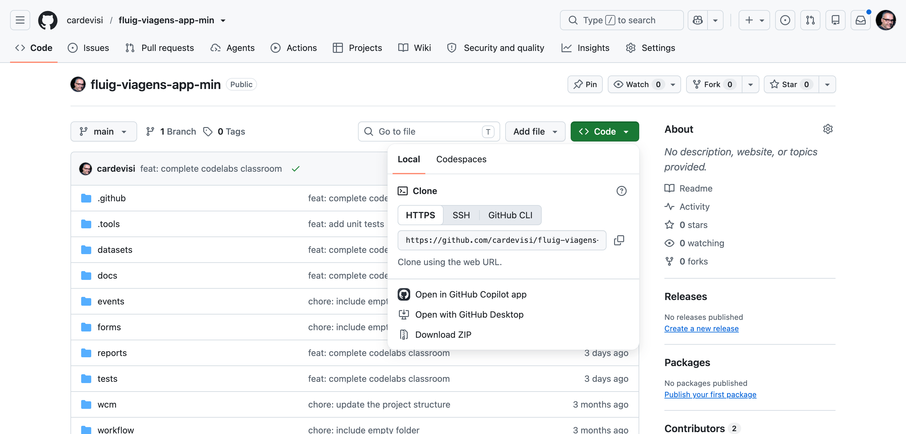
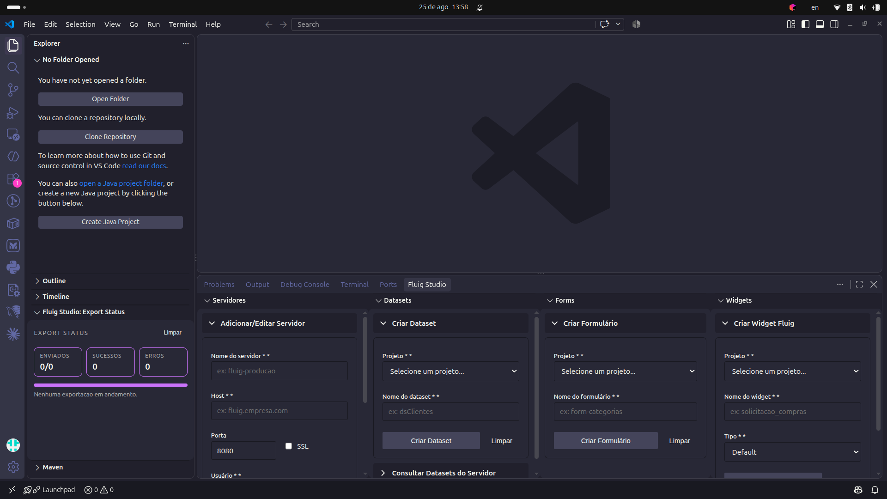
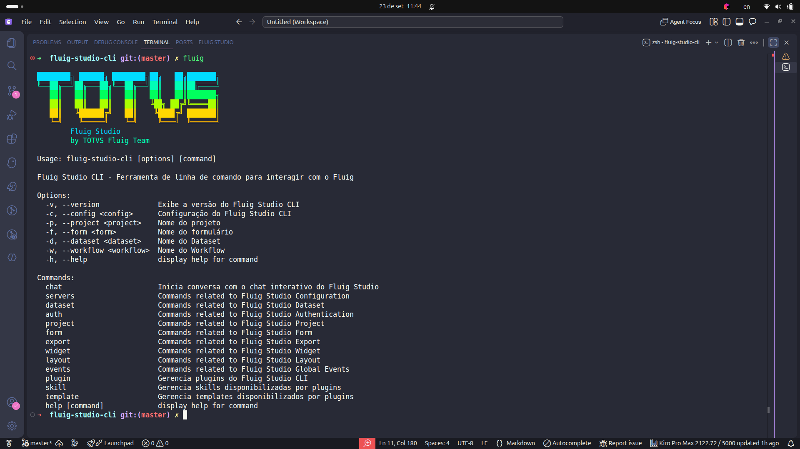

summary: Reconstrua do zero o projeto fluig-viagens-app com dataset, teste de contrato e pipeline CI/CD simplificado.
id: reconstruindo-fluig-viagens-app
categories: Fluig, CI/CD, GitHub Actions
environments: web
tags: fluig, github-actions, nodejs, ci-cd, codelab
status: Published
authors: TOTVS - Fluig Studio
feedback link: https://github.com/cardevisi/fluig-viagens-app/issues

# Reconstruindo o fluig-viagens-app: dataset, teste de contrato e pipeline simplificado

## Introdução
Duration: 0:03:00

Neste codelab, você vai reconstruir o projeto **fluig-viagens-app**, acompanhando um fluxo de desenvolvimento que se aproxima de times que precisam publicar com mais segurança e qualidade.
Ao longo da aula, você vai entender como **combinar implementação, testes automatizados e pipeline de CI/CD** para criar uma camada de qualidade antes do envio de recursos para produção. Em vez de focar apenas no código do dataset, a proposta é mostrar o caminho completo: **desenvolver, validar, automatizar e preparar a publicação em um servidor Fluig remoto com o apoio do GitHub Actions.**

### O que você vai aprender

- Como escrever um dataset Fluig simples.
- Como executar testes unitários localmente e a partir do pipeline CI/CD.
- Como detectar datasets alterados no GitHub Actions.
- Como um pipeline no Github Actions funciona.
- Como usar um workflow único para teste e deploy.
- Como encapsular o Fluig CLI em Docker para manter o pipeline limpo.
- Como utilizar o novo Fluig CLI para automatizar fluxos dentro do pipeline.

### O que você vai construir

```text
fluig-viagens-app-alunoNN/
├── .github/
│   ├── docker/
│   │   └── fluig-cli/
│   │       └── Dockerfile
│   ├── scripts/
│   │   └── fluig-resource-deploy.mjs
│   └── workflows/
│       └── fluig-deploy.yml
├── datasets/
│   └── ds-viagens-paises-alunoNN.js
├── tests/
│   └── datasets.test.js
├── docs/
│   ├── assets/
│   ├── build-codelab.mjs
│   ├── codelab-fluig-viagens-app.md
│   └── proposta-pipeline.md
├── events/
├── forms/
├── reports/
│   └── mechanisms/
├── wcm/
│   └── widget/
├── workflow/
├── .dockerignore
├── .gitignore
├── README.md
├── fluig.json
└── package.json
```

<!-- Os três blocos que você realmente vai mexer na aula são `datasets/`, `tests/` e `.github/`. -->

> aside positive
> As pastas `events/`, `forms/`, `reports/`, `wcm/` e `workflow/` fazem parte do scaffold padrão de
> um projeto Fluig e chegam vazias (apenas com `.gitkeep`). Elas continuam no repositório porque é
> ali que outros tipos de recurso entrariam num projeto real, mas não são usadas neste laboratório.

## Pré-requisitos
Duration: 0:03:00

Você vai precisar de:

### 1. Node.js 20 ou superior

```bash
node --version
```

### 2. Git

```bash
git --version
```

### 3. Uma conta no GitHub

Você precisa ter acesso à organização que hospeda os repositórios da aula:

<https://github.com/Projeto-Universo-TOTVS>


### 4. Acesso a um ambiente Fluig

**Ambiente**

Primeiramente, tenha certeza que o serviço do Fluig esteja rodando em sua máquina local.

- Ambiente: <https://universo2.nimbvs.fluig.io/portal/p/universo/home>
- Usuário: `universo`
- Senha: `Universo@2026`


## Abrindo a pasta de trabalho
Duration: 0:02:00

Você vai usar o **Kiro** como editor durante toda a aula. Antes de clonar o repositório, crie (ou
confirme que já existe) uma pasta chamada **Universo 2026** na sua Área de trabalho (Desktop) e
abra-a no Kiro. É dentro dela que você vai clonar o seu repositório e trabalhar durante toda a
aula.

### 1. Crie a pasta Universo 2026

Se a pasta ainda não existir no seu computador, crie-a na **Área de Trabalho**:

1. Minimize as janelas abertas (tecla `Windows + D`) até ver a Área de Trabalho.
2. Clique com o botão direito em uma área vazia e escolha **Novo > Pasta**.
3. Nomeie a pasta exatamente como `Universo 2026` e pressione `Enter`.

### 2. Abra o Kiro

Clique no menu **Iniciar** do Windows, digite `Kiro` e abra o aplicativo. Se esta for a primeira
vez, você verá a tela inicial de boas-vindas.

### 3. Abra a pasta Universo 2026 no Kiro

Use um dos caminhos abaixo:

- No menu, acesse **File > Open Folder...**;
- Ou, na tela inicial, clique em **Open Folder**;
- Ou use o atalho `Ctrl+K Ctrl+O`.

Na janela do Windows que abrir, navegue até **Área de Trabalho**, selecione a pasta
`Universo 2026` e clique em **Selecionar Pasta**.

> aside negative
> Se a pasta `Universo 2026` ainda não existir, você pode criá-la nessa mesma janela: clique com o
> botão direito dentro da Área de Trabalho e escolha **Novo > Pasta**, nomeie como `Universo 2026`
> e então selecione-a.

Se aparecer um aviso perguntando se você confia nos autores dos arquivos da pasta, clique em
**Yes, I trust the authors** (ou equivalente).

### 4. Abra o terminal integrado do Kiro

Com a pasta `Universo 2026` aberta no Kiro, abra o terminal integrado:

- Menu **Terminal > New Terminal**;
- Ou atalho `` Ctrl+` ``.

Por padrão, o terminal integrado do Kiro no Windows abre no **PowerShell**.

### 5. Confirme que está no lugar certo

No terminal integrado do Kiro, rode:

```powershell
pwd
```

A saída deve apontar para o caminho da pasta `Universo 2026` que você acabou de abrir, por exemplo
`C:\Users\<seu-usuario>\Desktop\Universo 2026`. É dentro dela, usando o terminal integrado do
próprio Kiro, que o clone do seu repositório vai acontecer no próximo passo.

## Clone o projeto
Duration: 0:02:00

**Cada aluno tem o seu próprio repositório, já criado previamente no GitHub.** Você só precisa  clonar.

Os repositórios seguem o padrão de nome `fluig-viagens-app-alunoNN`, dentro da conta ou organização
GitHub informada pelo instrutor:

Conta do github:
<https://github.com/Projeto-Universo-TOTVS>

| Aluno | Repositório |
|---|---|
| Aluno 01 | `<GITHUB_ORG>/fluig-viagens-app-aluno01` |
| Aluno 02 | `<GITHUB_ORG>/fluig-viagens-app-aluno02` |
| Aluno 03 | `<GITHUB_ORG>/fluig-viagens-app-aluno03` |
| ... | `<GITHUB_ORG>/fluig-viagens-app-alunoNN` |



### 1. Identifique o seu repositório

Confirme com o instrutor qual `GITHUB_ORG` (conta ou organização que hospeda os repositórios) e
qual `ALUNO_ID` foram atribuídos a você, e defina as variáveis abaixo. O exemplo usa `alunoNN`:

```bash
GITHUB_ORG="Projeto-Universo-TOTVS"
ALUNO_ID="alunoNN"
REPO_ALUNO="fluig-viagens-app-${ALUNO_ID}"
REPO_SSH="git@github-AlunoUniverso2026:${GITHUB_ORG}/${REPO_ALUNO}.git"
echo "$REPO_SSH"
```

### 2. Clone o seu repositório

```bash
git clone "$REPO_SSH"
cd "${REPO_ALUNO}"
```

### 3. Confirme que está no lugar certo

O `origin` precisa apontar para o repositório com o **seu** `ALUNO_ID`:

```bash
git remote -v
git branch --show-current
```

### 4. Valide o projeto localmente

```bash
npm test
```

Se os testes passarem, o seu ambiente está pronto para o resto da aula.

### 5. Conhecendo o projeto fluig-viagens-app

```text
fluig-viagens-app-alunoNN/
├── .github/
├── datasets/
├── tests/
├── docs/
├── events/
├── forms/
├── reports/
├── wcm/
├── workflow/
├── .dockerignore
├── .gitignore
├── README.md
├── fluig.json
└── package.json
```

> aside negative
> Trabalhe somente no repositório com o seu `ALUNO_ID`. Todos os passos seguintes (dataset, teste e
> pipeline) assumem que você está dentro dessa pasta, e o deploy no fim da aula usa os Secrets
> configurados nesse repositório específico.

## Demonstração rápida: Extensão VS Code
Duration: 0:02:00

Antes de começar a implementação, conheça a nova extensão para VS Code para desenvolvimento no Fluig. A seguir, uma visão geral das principais funcionalidades que você poderá usar no seu dia a dia.



Principais recursos da extensão VS Code para Fluig:

- Criação de projetos, datasets, formulários, widgets e layouts;
- Criação e gerenciamento de ambientes (Por exemplo: dev, homologação, produção);
- Criação e gerenciamento de recursos Fluig;
- Recursos que ajudam na produtividade durante o desenvolvimento;
- Integração com o restante do fluxo explorado ao longo da aula.
- MCP no Fluig CLI para automação de operações e desenvolvimento assistido por IA.

> aside positive
> A extensão do VS Code segue em desenvolvimento, e novas versões trarão mais recursos e melhorias.

## Demonstração rápida: Novo Fluig CLI e MCP
Duration: 0:02:00

Com a visão geral da extensão, veja agora o Fluig CLI em funcionamento. Esse
momento é importante para você perceber como a experiência de uso do Fluig CLI se conecta com a
automação que aparece mais adiante no pipeline.



Esta demonstração usa uma sequência curta de comandos do Fluig CLI como exemplo:

```bash
fluig --help
fluig dataset list
fluig projects list
fluig servers list
```

Ao acompanhar o terminal, observe estes pontos:

- O CLI pode ser usado localmente para explorar comandos e operações do projeto;
- Ele também pode ser executado de forma automatizada no pipeline;
- A mesma lógica de automação reaparece no processo de deploy mostrado neste codelab.

> aside positive
> Esta demonstração é importante para que você perceba que o Fluig CLI pode ser usado tanto no seu
> ambiente local quanto na automação do projeto. Assim, fica mais fácil entender como os comandos
> vistos aqui também aparecem no pipeline de validação e deploy.

## Estrutura mínima do projeto
Duration: 0:03:00

A implementação mínima aqui demostrada tem foco em três blocos:

1. `datasets/`: onde ficam os datasets Fluig.
2. `tests/`: onde ficam os testes automatizados.
3. `.github/`: onde ficam Dockerfile, script de deploy e workflow.

Essa estrutura é suficiente para demonstrar como configurar uma esteira completa de desenvolvimento, com testes automatizados e pipeline de CI/CD. Mas você poderá expandir a estrutura de acordo com suas necessidades.

## package.json: comando de teste
Duration: 0:02:00

O `package.json` atual tem apenas um comando de teste:

```json
{
  "name": "fluig-viagens-app",
  "version": "1.0.0",
  "private": true,
  "description": "Exemplo mínimo de testes e deploy de datasets Fluig",
  "scripts": {
    "test": "node --test"
  },
  "engines": {
    "node": ">=20"
  }
}
```

Com isso, basta rodar:

```bash
npm test
```

## fluig.json: configuração mínima do projeto
Duration: 0:03:00

O `fluig.json` é o arquivo que concentra os metadados e as configurações principais do projeto
Fluig. Em projetos maiores, ele pode reunir informações sobre o projeto, integrações com o CLI e
parâmetros usados em processos de automação. Em outras palavras, é um ponto central de
configuração que ajuda as ferramentas do ecossistema a entenderem como o projeto deve ser lido e
executado.

No modelo atual, o `fluig.json` guarda apenas o essencial para o script de deploy:

```json
{
  "name": "fluig-viagens-app",
  "description": "Projeto de viagens com dataset e teste de contrato",
  "version": "1.0.0",
  "author": "Carlos Oliveira",
  "license": "UNLICENSED",
  "cli": {
    "serverName": "fluig-ci"
  }
}
```

### O que cada campo faz

| Chave | Função |
|---|---|
| `name` | Nome lógico do projeto |
| `description` | Descreve de forma resumida o objetivo do projeto |
| `version` | Indica a versão atual do projeto |
| `author` | Identifica quem mantém ou publicou o projeto |
| `license` | Define o tipo de licença associado ao projeto |
| `cli.serverName` | Nome base usado pelo script para criar o servidor no Fluig CLI |

> aside positive
> Para você que está acompanhando a aula, o ponto principal aqui é: o pipeline já usa uma imagem
> Docker pronta com o Fluig CLI configurado. Isso reduz a quantidade de passos no processo e
> facilita o entendimento do que realmente importa no deploy.

## Dataset de países
Duration: 0:06:00

Neste passo você vai criar `datasets/ds-viagens-paises-alunoNN.js` executando um prompt no Kiro.
No Fluig, a função `createDataset(fields, constraints, sortFields)` devolve um objeto montado com
`DatasetBuilder`.

Na prática, esses parâmetros representam:

- `fields`: as colunas solicitadas pela consulta;
- `constraints`: os filtros recebidos na chamada do dataset;
- `sortFields`: os campos pedidos para ordenação.

Neste exemplo, eles aparecem para respeitar o contrato do Fluig, mesmo sem influenciarem o retorno,
porque o dataset devolve sempre a mesma lista fixa de países.

### Prompt para construir o dataset com o Kiro

Crie o arquivo `datasets/ds-viagens-paises-alunoNN.js` (troque `alunoNN` pelo seu `ALUNO_ID`) e
use o prompt abaixo no Kiro para gerar o conteúdo do dataset:

```text
Crie um dataset Fluig no arquivo datasets/ds-viagens-paises-alunoNN.js seguindo estas regras:

1. Exponha uma função global `createDataset(fields, constraints, sortFields)`.
2. Não use `require`, `import` ou `module.exports`: no runtime do Fluig as globais já existem.
3. Use `var` e sintaxe ES5, compatível com o motor de script do Fluig.
4. Os três parâmetros existem apenas para respeitar o contrato do Fluig. Neutralize-os com
   `void fields;`, `void constraints;` e `void sortFields;` e explique isso em comentário.
5. Monte o retorno com `DatasetBuilder.newDataset()`.
6. Declare exatamente 3 colunas, nesta ordem: `codigo`, `nome` e `sigla`.
7. Preencha 20 países como arrays de strings no formato
   [codigo ISO-3, nome em português, sigla ISO-2].
   Inclua obrigatoriamente ["BRA", "Brasil", "BR"] como primeira linha.
8. Adicione as linhas com `ds.addRow()` dentro de um laço `for` clássico.
9. Retorne o objeto `ds` no final da função.
```

> aside positive
> Peça ao Kiro para manter os comentários explicando a assinatura da função. Eles ajudam quem for
> ler o dataset depois a entender por que os parâmetros existem mesmo sem serem usados.

Resultado esperado:

```javascript
function createDataset(fields, constraints, sortFields) {
  // Assinatura padrão de datasets no Fluig:
  // - fields: colunas solicitadas pela consulta
  // - constraints: filtros recebidos na chamada
  // - sortFields: campos pedidos para ordenação
  void fields;
  void constraints;
  void sortFields;

  var ds = DatasetBuilder.newDataset();
  var rows = [
    ["BRA", "Brasil", "BR"],
    ["USA", "Estados Unidos", "US"],
    ["ARG", "Argentina", "AR"],
    ["CHL", "Chile", "CL"],
    ["URY", "Uruguai", "UY"],
    ["PRY", "Paraguai", "PY"],
    ["BOL", "Bolívia", "BO"],
    ["PER", "Peru", "PE"],
    ["COL", "Colômbia", "CO"],
    ["VEN", "Venezuela", "VE"],
    ["MEX", "México", "MX"],
    ["DEU", "Alemanha", "DE"],
    ["ESP", "Espanha", "ES"],
    ["PRT", "Portugal", "PT"],
    ["FRA", "França", "FR"],
    ["ITA", "Itália", "IT"],
    ["GBR", "Reino Unido", "GB"],
    ["JPN", "Japão", "JP"],
    ["CHN", "China", "CN"],
    ["AUS", "Austrália", "AU"],
  ];

  ds.addColumn("codigo");
  ds.addColumn("nome");
  ds.addColumn("sigla");

  for (var i = 0; i < rows.length; i++) {
    ds.addRow(rows[i]);
  }

  return ds;
}
```

### O que observar

- O dataset tem 3 colunas: `codigo`, `nome` e `sigla`.
- Cada linha é um array simples de strings.
- O script não depende de `require`, porque no Fluig as globais já existem no runtime.

## Teste do dataset
Duration: 0:15:00

Em vez de criar toda a estrutura de teste do zero para cada dataset, o projeto usa uma base
reaproveitável de validação:

`tests/datasets.test.js`

Essa base concentra apenas o que pode ser compartilhado entre diferentes datasets. Ela faz quatro
coisas:

1. varre a pasta `datasets/`;
2. executa cada script dentro de um sandbox;
3. injeta mocks de `DatasetBuilder`;
4. valida um contrato mínimo para todos os datasets.

Isso é útil porque futuros datasets podem ter estruturas e regras de negócio diferentes, mas ainda
assim continuarão precisando de algumas validações comuns, como carregamento do script, criação do
dataset e consistência entre colunas e linhas.

### A regra AAA

Antes de olhar o código, vale fixar o padrão que organiza todo teste bem escrito:

| Fase | O que faz |
|---|---|
| **Arrange** (preparar) | Configura o cenário, cria os dados necessários e prepara o ambiente. |
| **Act** (agir) | Executa a ação ou função que se deseja testar. |
| **Assert** (validar) | Checa se o resultado obtido é igual ao resultado esperado. |

Neste teste, cada fase tem um papel bem concreto:

- **Arrange** é montar o sandbox com os mocks de `DatasetBuilder` e executar o
  script do dataset ali dentro. É o que substitui o servidor Fluig.
- **Act** é chamar `createDataset([], [], [])`, exatamente como o Fluig faria ao consultar o
  dataset.
- **Assert** é comparar colunas e linhas com o contrato esperado.

### Montando o teste passo a passo

Em vez de colar o arquivo inteiro de uma vez, monte o teste em sete blocos. Cada bloco acrescenta
um comportamento, e depois de cada um você roda `npm test` e vê a suíte crescer.

Crie o arquivo `tests/datasets.test.js` vazio e vá **acrescentando cada bloco ao final** dele.

> aside positive
> A ordem em que os blocos entram no arquivo não precisa ser a mesma da versão final. Em
> JavaScript, declarações de função sofrem *hoisting*: são registradas antes da execução, então um
> `test()` pode chamar uma função declarada mais abaixo no arquivo. Por isso o
> "Arquivo completo para cópia" agrupa os helpers no fim, enquanto aqui cada helper aparece junto
> do teste que o estreia.

#### Passo 1: base do arquivo

Comece pelos imports e pelas constantes que o restante do arquivo usa. `COUNTRIES_PREFIX` é o que
permite o teste funcionar sem edição, qualquer que seja o seu `ALUNO_ID`.

```javascript
"use strict";

const { test } = require("node:test");
const assert = require("node:assert/strict");
const fs = require("node:fs");
const path = require("node:path");
const vm = require("node:vm");

const projectRoot = path.join(__dirname, "..");
const datasetsDir = path.join(projectRoot, "datasets");

// Prefixo dos datasets de países da aula. Cobre qualquer sufixo de aluno
// (ds-viagens-paises-aluno01.js, -aluno02.js, ...) sem precisar editar nada.
const COUNTRIES_PREFIX = "datasets/ds-viagens-paises";
const COUNTRIES_COLUMNS = ["codigo", "nome", "sigla"];
const COUNTRIES_TOTAL = 20;
```

```bash
npm test
```

A saída mostra `# tests 1`, mas nenhum teste foi declarado ainda. Esse 1 é o próprio arquivo: o
`node --test` conta cada arquivo de teste como uma unidade. A partir do próximo passo o número
passa a refletir os testes de verdade.

#### Passo 2: descobrir os datasets

O primeiro teste não valida dataset nenhum: ele valida que a suíte **encontrou** o que precisa
testar. Sem ele, um erro de caminho deixaria todos os laços vazios e a suíte ficaria verde sem
validar nada.

Junto vêm os dois helpers de descoberta.

```javascript
// Lista recursivamente todos os arquivos .js da pasta datasets
// para que qualquer novo recurso já entre automaticamente nos testes.
function listDatasetFiles(dir, root = projectRoot) {
  return fs
    .readdirSync(dir, { withFileTypes: true })
    .flatMap((entry) => {
      const fullPath = path.join(dir, entry.name);
      if (entry.isDirectory()) {
        return listDatasetFiles(fullPath, root);
      }

      if (entry.isFile() && entry.name.endsWith(".js")) {
        return [path.relative(root, fullPath).split(path.sep).join("/")];
      }

      return [];
    })
    .sort();
}

// Separa os datasets de países dos demais, para que as regras de negócio
// só sejam aplicadas a quem realmente precisa atendê-las.
function filterCountriesDatasets(datasetFiles) {
  return datasetFiles.filter((relativePath) =>
    relativePath.startsWith(COUNTRIES_PREFIX),
  );
}

test("a pasta datasets contém datasets para testar", () => {
  // Arrange
  const datasetsPath = datasetsDir;

  // Act
  const datasetFiles = listDatasetFiles(datasetsPath);
  const countriesFiles = filterCountriesDatasets(datasetFiles);

  // Assert
  assert.notEqual(
    datasetFiles.length,
    0,
    "nenhum arquivo .js encontrado em datasets/",
  );
  assert.notEqual(
    countriesFiles.length,
    0,
    `nenhum dataset encontrado com o prefixo ${COUNTRIES_PREFIX}`,
  );
});
```

```bash
npm test
```

Agora `# pass 1`, e o nome do teste aparece na saída.

#### Passo 3: garantir a função createDataset

Esta é a cláusula central do contrato com o Fluig: o servidor chama uma `createDataset` global,
então o script precisa declará-la no nível superior. Aqui entram os dois helpers que substituem o
servidor Fluig.

```javascript
// Arrange: monta o contexto com os mocks das globais que o Fluig fornece
// em produção. O mock implementa apenas o necessário para este projeto.
function createFluigSandbox() {
  return {
    console,
    DatasetBuilder: {
      newDataset() {
        const columns = [];
        const rows = [];

        return {
          addColumn(name, type) {
            columns.push({ name, type });
          },
          addRow(values) {
            rows.push(values);
          },
          getColumns() {
            return columns;
          },
          getRows() {
            return rows;
          },
        };
      },
    },
  };
}

// Act de baixo nível: executa o arquivo exatamente como o Fluig faria.
// Por ser um script (e não um módulo), a declaração `function createDataset`
// no nível superior passa a ser propriedade do objeto global, que dentro
// do vm é o próprio sandbox.
function runDatasetScript(relativePath, sandbox) {
  const fullPath = path.join(projectRoot, relativePath);
  const code = fs.readFileSync(fullPath, "utf8");

  vm.createContext(sandbox);
  vm.runInContext(code, sandbox, { filename: fullPath });

  return sandbox;
}

test("todo dataset declara a função global createDataset", async (t) => {
  for (const relativePath of listDatasetFiles(datasetsDir)) {
    await t.test(relativePath, () => {
      // Arrange: contexto isolado com as globais que o Fluig injeta.
      const sandbox = createFluigSandbox();

      // Act: executa o script do dataset dentro desse contexto.
      runDatasetScript(relativePath, sandbox);

      // Assert: o Fluig chama uma createDataset global, então o script
      // precisa declará-la no nível superior para o deploy fazer sentido.
      assert.equal(
        typeof sandbox.createDataset,
        "function",
        `${relativePath} deve declarar a função global createDataset`,
      );
    });
  }
});
```

```bash
npm test
```

O total salta para `# pass 3`. Esse teste usa `t.test()` para criar um subteste por dataset, então
ele conta como 1 teste pai mais 1 subteste para cada arquivo da pasta.

#### Passo 4: validar colunas e linhas

Daqui em diante os testes precisam **chamar** a `createDataset`. O helper `loadCreateDataset`
concentra esse Arrange e devolve a função pronta.

```javascript
// Arrange completo para os testes de comportamento: devolve a createDataset
// pronta para ser chamada no passo Act. Aqui é `throw`, e não `assert`,
// porque um cenário que não pode ser montado é falha de setup, não de
// expectativa. A existência da função é verificada em teste próprio.
function loadCreateDataset(relativePath) {
  const sandbox = runDatasetScript(relativePath, createFluigSandbox());

  if (typeof sandbox.createDataset !== "function") {
    throw new Error(
      `${relativePath} não declarou a função global createDataset. ` +
        `Use "function createDataset(...)" no nível superior do arquivo, ` +
        `sem module.exports, export ou IIFE.`,
    );
  }

  return sandbox.createDataset;
}

test("todo dataset devolve colunas e linhas consistentes", async (t) => {
  for (const relativePath of listDatasetFiles(datasetsDir)) {
    await t.test(relativePath, () => {
      // Arrange
      const createDataset = loadCreateDataset(relativePath);

      // Act: reproduz a chamada do Fluig com fields, constraints e sortFields
      // vazios, ou seja, a consulta mais simples possível.
      const dataset = createDataset([], [], []);
      const columns = dataset.getColumns();
      const rows = dataset.getRows();
      const columnNames = columns.map((column) => column.name);

      // Assert
      assert.ok(Array.isArray(columns), "getColumns deve devolver um array");
      assert.ok(Array.isArray(rows), "getRows deve devolver um array");
      assert.notEqual(columns.length, 0, "dataset sem colunas declaradas");
      assert.equal(
        new Set(columnNames).size,
        columnNames.length,
        `${relativePath} declara colunas com nome duplicado`,
      );

      for (const [index, row] of rows.entries()) {
        assert.equal(
          row.length,
          columns.length,
          `linha ${index} tem ${row.length} valores para ${columns.length} colunas`,
        );
      }
    });
  }
});
```

```bash
npm test
```

`# pass 5`. Este é o último teste do contrato genérico: tudo aqui vale para qualquer dataset, sem
mencionar país nenhum.

#### Passo 5: travar a ordem das colunas

Começam as regras de negócio, aplicadas só aos datasets de países. Repare no
`filterCountriesDatasets` envolvendo a lista: é o que impede que um `ds-viagens-cidades.js` futuro
seja obrigado a ter as colunas de país.

```javascript
test("todo dataset de países expõe as colunas na ordem esperada", async (t) => {
  for (const relativePath of filterCountriesDatasets(
    listDatasetFiles(datasetsDir),
  )) {
    await t.test(relativePath, () => {
      // Arrange
      const createDataset = loadCreateDataset(relativePath);

      // Act
      const dataset = createDataset([], [], []);
      const columnNames = dataset
        .getColumns()
        .map((column) => column.name);

      // Assert: a ordem faz parte do contrato, não só os nomes. O Fluig
      // entrega cada linha como array posicional, sem chave: quem consome
      // (formulário, widget, zoom) lê row[0], row[1] e row[2]. Conferir
      // posição por posição aponta exatamente qual coluna saiu do lugar.
      assert.equal(columnNames[0], "codigo");
      assert.equal(columnNames[1], "nome");
      assert.equal(columnNames[2], "sigla");
      assert.equal(columnNames.length, COUNTRIES_COLUMNS.length);
    });
  }
});
```

```bash
npm test
```

`# pass 7`.

#### Passo 6: conferir o total de países

```javascript
test("todo dataset de países devolve a lista completa", async (t) => {
  for (const relativePath of filterCountriesDatasets(
    listDatasetFiles(datasetsDir),
  )) {
    await t.test(relativePath, () => {
      // Arrange
      const createDataset = loadCreateDataset(relativePath);

      // Act
      const rows = createDataset([], [], []).getRows();

      // Assert
      assert.equal(
        rows.length,
        COUNTRIES_TOTAL,
        `${relativePath} deve ter ${COUNTRIES_TOTAL} países`,
      );
    });
  }
});
```

```bash
npm test
```

`# pass 9`.

#### Passo 7: conferir a linha do Brasil

O último teste valida um registro conhecido de ponta a ponta. O `assert.ok(brazil, ...)` antes do
`deepEqual` existe para a falha dizer "não achei a linha BRA" em vez de estourar um `TypeError` ao
tentar ler `undefined`.

```javascript
test("todo dataset de países contém a linha do Brasil", async (t) => {
  for (const relativePath of filterCountriesDatasets(
    listDatasetFiles(datasetsDir),
  )) {
    await t.test(relativePath, () => {
      // Arrange
      const createDataset = loadCreateDataset(relativePath);

      // Act
      const rows = createDataset([], [], []).getRows();
      const brazil = rows.find((row) => row[0] === "BRA");

      // Assert
      assert.ok(brazil, `${relativePath} não tem a linha com código BRA`);
      assert.deepEqual(Array.from(brazil), ["BRA", "Brasil", "BR"]);
    });
  }
});
```

```bash
npm test
```

`# pass 11`.

#### Resumo da montagem

Os números abaixo valem para uma pasta `datasets/` com **um** dataset:

| Passo | O que entra | Testes acumulados |
|---|---|---|
| 1 | imports e constantes | 1 (só o arquivo) |
| 2 | descoberta dos datasets | 1 |
| 3 | contrato da `createDataset` | 3 |
| 4 | colunas e linhas consistentes | 5 |
| 5 | ordem das colunas | 7 |
| 6 | total de países | 9 |
| 7 | linha do Brasil | 11 |

Se a sua pasta tiver dois datasets, cada teste dos passos 3 a 7 ganha um subteste extra, e o total
final vira 16 em vez de 11.

> aside positive
> Vale experimentar quebrar o dataset de propósito: troque a ordem de `nome` e `sigla` nas chamadas
> de `addColumn` e rode `npm test`. Só o teste do passo 5 falha, e a mensagem aponta a coluna errada.
> Os outros continuam verdes, mostrando que o resto do contrato segue intacto. É essa precisão que
> um teste único validando tudo não consegue dar.

### Arquivo completo para cópia

Esta é a versão final do arquivo, com os sete blocos já reunidos e os helpers agrupados no fim.
Use como referência para conferir a sua montagem, ou copie na íntegra caso prefira pular o passo a
passo.

Cada teste segue a regra **AAA**, com as três fases marcadas em comentário:

- **Arrange**: prepara o cenário, montando o sandbox com os mocks do runtime do Fluig.
- **Act**: executa a ação sob teste, rodando o script ou chamando `createDataset`.
- **Assert**: compara o resultado obtido com o esperado.

```javascript
"use strict";

const { test } = require("node:test");
const assert = require("node:assert/strict");
const fs = require("node:fs");
const path = require("node:path");
const vm = require("node:vm");

const projectRoot = path.join(__dirname, "..");
const datasetsDir = path.join(projectRoot, "datasets");

// Prefixo dos datasets de países da aula. Cobre qualquer sufixo de aluno
// (ds-viagens-paises-aluno01.js, -alunoNN.js, ...) sem precisar editar nada.
const COUNTRIES_PREFIX = "datasets/ds-viagens-paises";
const COUNTRIES_COLUMNS = ["codigo", "nome", "sigla"];
const COUNTRIES_TOTAL = 20;

// ===========================================================================
// Cada teste abaixo segue a regra AAA:
//   Arrange  prepara o cenário (sandbox com os mocks do runtime do Fluig)
//   Act      executa a ação sob teste (rodar o script / chamar createDataset)
//   Assert   compara o resultado obtido com o esperado
// ===========================================================================

// ---------------------------------------------------------------------------
// Descoberta: garante que a suíte realmente encontrou o que precisa testar.
// Sem isso, um erro de caminho faria a suíte passar sem validar nada.
// ---------------------------------------------------------------------------
test("a pasta datasets contém datasets para testar", () => {
  // Arrange
  const datasetsPath = datasetsDir;

  // Act
  const datasetFiles = listDatasetFiles(datasetsPath);
  const countriesFiles = filterCountriesDatasets(datasetFiles);

  // Assert
  assert.notEqual(
    datasetFiles.length,
    0,
    "nenhum arquivo .js encontrado em datasets/",
  );
  assert.notEqual(
    countriesFiles.length,
    0,
    `nenhum dataset encontrado com o prefixo ${COUNTRIES_PREFIX}`,
  );
});

// ---------------------------------------------------------------------------
// Contrato genérico: vale para qualquer dataset da pasta datasets/.
// ---------------------------------------------------------------------------
test("todo dataset declara a função global createDataset", async (t) => {
  for (const relativePath of listDatasetFiles(datasetsDir)) {
    await t.test(relativePath, () => {
      // Arrange: contexto isolado com as globais que o Fluig injeta.
      const sandbox = createFluigSandbox();

      // Act: executa o script do dataset dentro desse contexto.
      runDatasetScript(relativePath, sandbox);

      // Assert: o Fluig chama uma createDataset global, então o script
      // precisa declará-la no nível superior para o deploy fazer sentido.
      assert.equal(
        typeof sandbox.createDataset,
        "function",
        `${relativePath} deve declarar a função global createDataset`,
      );
    });
  }
});

test("todo dataset devolve colunas e linhas consistentes", async (t) => {
  for (const relativePath of listDatasetFiles(datasetsDir)) {
    await t.test(relativePath, () => {
      // Arrange
      const createDataset = loadCreateDataset(relativePath);

      // Act: reproduz a chamada do Fluig com fields, constraints e sortFields
      // vazios, ou seja, a consulta mais simples possível.
      const dataset = createDataset([], [], []);
      const columns = dataset.getColumns();
      const rows = dataset.getRows();
      const columnNames = columns.map((column) => column.name);

      // Assert
      assert.ok(Array.isArray(columns), "getColumns deve devolver um array");
      assert.ok(Array.isArray(rows), "getRows deve devolver um array");
      assert.notEqual(columns.length, 0, "dataset sem colunas declaradas");
      assert.equal(
        new Set(columnNames).size,
        columnNames.length,
        `${relativePath} declara colunas com nome duplicado`,
      );

      for (const [index, row] of rows.entries()) {
        assert.equal(
          row.length,
          columns.length,
          `linha ${index} tem ${row.length} valores para ${columns.length} colunas`,
        );
      }
    });
  }
});

// ---------------------------------------------------------------------------
// Regra de negócio: específica dos datasets de países.
// ---------------------------------------------------------------------------
test("todo dataset de países expõe as colunas na ordem esperada", async (t) => {
  for (const relativePath of filterCountriesDatasets(
    listDatasetFiles(datasetsDir),
  )) {
    await t.test(relativePath, () => {
      // Arrange
      const createDataset = loadCreateDataset(relativePath);

      // Act
      const dataset = createDataset([], [], []);
      const columnNames = dataset
        .getColumns()
        .map((column) => column.name);

      // Assert: a ordem faz parte do contrato, não só os nomes. O Fluig
      // entrega cada linha como array posicional, sem chave: quem consome
      // (formulário, widget, zoom) lê row[0], row[1] e row[2]. Conferir
      // posição por posição aponta exatamente qual coluna saiu do lugar.
      assert.equal(columnNames[0], "codigo");
      assert.equal(columnNames[1], "nome");
      assert.equal(columnNames[2], "sigla");
      assert.equal(columnNames.length, COUNTRIES_COLUMNS.length);
    });
  }
});

test("todo dataset de países devolve a lista completa", async (t) => {
  for (const relativePath of filterCountriesDatasets(
    listDatasetFiles(datasetsDir),
  )) {
    await t.test(relativePath, () => {
      // Arrange
      const createDataset = loadCreateDataset(relativePath);

      // Act
      const rows = createDataset([], [], []).getRows();

      // Assert
      assert.equal(
        rows.length,
        COUNTRIES_TOTAL,
        `${relativePath} deve ter ${COUNTRIES_TOTAL} países`,
      );
    });
  }
});

test("todo dataset de países contém a linha do Brasil", async (t) => {
  for (const relativePath of filterCountriesDatasets(
    listDatasetFiles(datasetsDir),
  )) {
    await t.test(relativePath, () => {
      // Arrange
      const createDataset = loadCreateDataset(relativePath);

      // Act
      const rows = createDataset([], [], []).getRows();
      const brazil = rows.find((row) => row[0] === "BRA");

      // Assert
      assert.ok(brazil, `${relativePath} não tem a linha com código BRA`);
      assert.deepEqual(Array.from(brazil), ["BRA", "Brasil", "BR"]);
    });
  }
});

// ===========================================================================
// Helpers de Arrange e Act. Nenhum deles faz assert: preparar o cenário e
// validar o resultado são responsabilidades separadas.
// ===========================================================================

// Lista recursivamente todos os arquivos .js da pasta datasets
// para que qualquer novo recurso já entre automaticamente nos testes.
function listDatasetFiles(dir, root = projectRoot) {
  return fs
    .readdirSync(dir, { withFileTypes: true })
    .flatMap((entry) => {
      const fullPath = path.join(dir, entry.name);
      if (entry.isDirectory()) {
        return listDatasetFiles(fullPath, root);
      }

      if (entry.isFile() && entry.name.endsWith(".js")) {
        return [path.relative(root, fullPath).split(path.sep).join("/")];
      }

      return [];
    })
    .sort();
}

// Separa os datasets de países dos demais, para que as regras de negócio
// só sejam aplicadas a quem realmente precisa atendê-las.
function filterCountriesDatasets(datasetFiles) {
  return datasetFiles.filter((relativePath) =>
    relativePath.startsWith(COUNTRIES_PREFIX),
  );
}

// Arrange: monta o contexto com os mocks das globais que o Fluig fornece
// em produção. O mock implementa apenas o necessário para este projeto.
function createFluigSandbox() {
  return {
    console,
    DatasetBuilder: {
      newDataset() {
        const columns = [];
        const rows = [];

        return {
          addColumn(name, type) {
            columns.push({ name, type });
          },
          addRow(values) {
            rows.push(values);
          },
          getColumns() {
            return columns;
          },
          getRows() {
            return rows;
          },
        };
      },
    },
  };
}

// Act de baixo nível: executa o arquivo exatamente como o Fluig faria.
// Por ser um script (e não um módulo), a declaração `function createDataset`
// no nível superior passa a ser propriedade do objeto global, que dentro
// do vm é o próprio sandbox.
function runDatasetScript(relativePath, sandbox) {
  const fullPath = path.join(projectRoot, relativePath);
  const code = fs.readFileSync(fullPath, "utf8");

  vm.createContext(sandbox);
  vm.runInContext(code, sandbox, { filename: fullPath });

  return sandbox;
}

// Arrange completo para os testes de comportamento: devolve a createDataset
// pronta para ser chamada no passo Act. Aqui é `throw`, e não `assert`,
// porque um cenário que não pode ser montado é falha de setup, não de
// expectativa. A existência da função é verificada em teste próprio.
function loadCreateDataset(relativePath) {
  const sandbox = runDatasetScript(relativePath, createFluigSandbox());

  if (typeof sandbox.createDataset !== "function") {
    throw new Error(
      `${relativePath} não declarou a função global createDataset. ` +
        `Use "function createDataset(...)" no nível superior do arquivo, ` +
        `sem module.exports, export ou IIFE.`,
    );
  }

  return sandbox.createDataset;
}
```

### O que observar no teste

O arquivo está dividido em camadas. Ler nessa ordem ajuda:

**1. Descoberta**, garante que a suíte realmente encontrou o que precisa testar.:

- `a pasta datasets contém datasets para testar` valida se existem arquivos datasets na pasta datasets.


**2. Contrato genérico**, aplicado a todo dataset da pasta:

- `dataset declara a função global createDataset` valida se todos os datasets criados possuem a função createDataset.
- `dataset devolve colunas e linhas consistentes` cobre o que vale para qualquer dataset:
  colunas e linhas são arrays, existe pelo menos uma coluna, não há nome de coluna duplicado e toda
  linha tem a mesma quantidade de valores que de colunas.

**3. Regra de negócio**, aplicada só aos datasets de países, selecionados por `COUNTRIES_PREFIX`:

- `expõe as colunas na ordem esperada` trava a **ordem**, não só os nomes. O Fluig entrega cada
  linha como array posicional, sem chave: quem consome lê `row[0]`, `row[1]` e `row[2]`. Conferir
  posição por posição aponta exatamente qual coluna saiu do lugar.
- `devolve a lista completa` confere o total de 20 países.
- `contém a linha do Brasil` confere um registro conhecido de ponta a ponta.

Nos helpers:

- `listDatasetFiles` varre a pasta recursivamente, então novos datasets entram nos testes sem
  precisar de ajuste.
- `filterCountriesDatasets` usa prefixo em vez de nome fixo. É isso que faz o arquivo funcionar sem
  edição, qualquer que seja o seu `ALUNO_ID`.
- `createFluigSandbox` e `runDatasetScript` são o Arrange: montam os mocks e executam o script no
  contexto isolado do `node:vm`.

### Execute localmente

```bash
npm test
```

> aside positive
> Neste projeto, o teste compartilhado não tenta resolver tudo sozinho. Ele cuida apenas do que é
> reaproveitável entre datasets. Já as validações de conteúdo e de regra de negócio continuam sendo
> específicas de cada recurso, o que deixa a estratégia mais flexível para projetos reais.

## Workflow único de CI/CD
Duration: 0:08:00

Workflow de CI/CD do projeto contendo dois jobs:

`/.github/workflows/fluig-deploy.yml`

Ele responde a:

- `push`
- `pull_request`
- `workflow_dispatch`

Os caminhos monitorados são:

```yaml
paths:
  - "datasets/**"
  - "tests/**"
  - ".github/**"
  - "fluig.json"
  - "package.json"
```

### Job de teste

O primeiro job é o `test`:

```yaml
test:
  runs-on: ubuntu-latest
  container:
    image: node:22-bookworm-slim

  steps:
    - name: Checkout
      uses: actions/checkout@v5

    - name: Rodar testes
      run: npm test
```

Esse job sempre vem antes do deploy.

### Job de deploy

O segundo job é o `deploy`, dependente do `test`:

```yaml
deploy:
  needs: test
  runs-on: ubuntu-latest
  if: >
    needs.test.result == 'success' &&
    (
      github.event_name == 'workflow_dispatch' ||
      (github.event_name == 'push' && github.ref == 'refs/heads/main')
    )
```

Ou seja:

- em `pull_request`, o workflow testa, mas não faz deploy;
- em `push` na `main`, ele testa e depois publica;
- em `workflow_dispatch`, o deploy pode ser disparado manualmente.

## Detectando apenas os datasets alterados
Duration: 0:05:00

O step `Descobrir datasets alterados` decide o que será publicado.

Quando a execução for manual, ele usa a entrada `dataset_paths`.
Quando a execução vier de `push`, ele calcula o diff entre commits:

```bash
BASE="${{ github.event.before }}"
if [[ -z "$BASE" || "$BASE" == "0000000000000000000000000000000000000000" ]]; then
  BASE="$(git rev-list --max-parents=0 HEAD | tail -n 1)"
fi

DATASETS="$(git diff --name-only "$BASE" "${GITHUB_SHA}" | grep '^datasets/.*\.js$' || true)"
```

Depois, a lista é enviada para `GITHUB_OUTPUT` como `steps.datasets.outputs.paths`.

Isso permite:

- fazer deploy apenas do que mudou;
- ou informar manualmente uma lista de datasets, um por linha.

## Imagem Docker do Fluig CLI
Duration: 0:04:00

O deploy não instala o Fluig CLI passo a passo no runner. Em vez disso, ele usa a imagem:

```text
ghcr.io/cardevisi/fluig-cli:0.1.0
```

O Dockerfile local que gera essa imagem fica em:

`/.github/docker/fluig-cli/Dockerfile`

Trecho principal:

```dockerfile
FROM node:22-bookworm-slim

ARG TARGETARCH

RUN case "${TARGETARCH}" in \
    "amd64") cp /tmp/fluig-standalone/fluig-cli-linux-x64 /usr/local/bin/fluig ;; \
    *) echo "Arquitetura suportada apenas para esta imagem: amd64. Recebido: ${TARGETARCH}" && exit 1 ;; \
  esac
```

### Por que isso importa

- o runner não baixa binários em tempo de execução;
- o deploy fica padronizado entre ambientes;
- a compatibilidade fica explícita: a imagem publicada atende apenas `amd64`.

## Script de deploy dentro do container
Duration: 0:07:00

O container inicia executando:

```text
node .github/scripts/fluig-resource-deploy.mjs
```

Esse script:

1. lê o `fluig.json`;
2. resolve a lista de datasets;
3. monta a conexão com base em `FLUIG_BASE_URL`, `FLUIG_USERNAME` e `FLUIG_PASSWORD`;
4. cria e autentica o servidor no CLI;
5. executa `export resource` para cada dataset selecionado.

Trecho do loop de deploy:

```javascript
for (const dataset of datasets) {
  const resourceName = path.basename(dataset, ".js");
  await runCli([
    "export",
    "resource",
    "--projectPath",
    workspace,
    "--resourceType",
    "dataset",
    "--resourceName",
    resourceName,
    "--serverName",
    connection.serverName,
  ]);
}
```

> aside positive
> O nome do recurso enviado ao CLI preserva o nome real do arquivo, incluindo hifens. Isso evita
> erros de localização do dataset no deploy.

## Secrets e variáveis
Duration: 0:04:00

Para o pipeline funcionar no GitHub, configure em **Settings > Secrets and variables > Actions**:

### Secrets obrigatórios

| Nome | Uso |
|---|---|
| `GHCR_TOKEN` | Token para autenticar no GHCR e baixar a imagem do CLI |
| `FLUIG_BASE_URL` | URL base do servidor Fluig |
| `FLUIG_USERNAME` | Usuário do Fluig |
| `FLUIG_PASSWORD` | Senha do Fluig |

### Variável opcional

| Nome | Uso |
|---|---|
| `FLUIG_SERVER_NAME` | Sobrescreve o nome base do servidor criado no CLI |

## Fluxo completo do pipeline
Duration: 0:03:00

Em resumo, a esteira atual faz:

1. checkout do código;
2. `npm test` no job `test`;
3. descoberta dos datasets alterados;
4. login no GHCR;
5. `docker pull ghcr.io/cardevisi/fluig-cli:0.1.0`;
6. `docker run` com as variáveis de ambiente do Fluig;
7. deploy dos datasets selecionados.

Esse fluxo vale tanto para execução automática na `main` quanto para disparo manual.

## Parabéns e próximos passos
Duration: 0:03:00

Você concluiu a leitura da implementação atual do projeto e já sabe:

- como o dataset está estruturado;
- como o teste de contrato protege todos os datasets;
- como o `fluig-deploy.yml` concentra teste e deploy;
- como o Fluig CLI foi encapsulado em Docker para simplificar a pipeline.

> aside positive
> O CLI não é apenas uma forma diferente de executar comandos do Fluig. Ele é
> uma peça que permite levar o desenvolvimento do Fluig para um fluxo mais automatizado e
> integrado às ferramentas que os times já utilizam.

> aside positive
> A partir daqui, o próximo passo é pensar: quais partes do seu processo hoje são manuais e
> poderiam fazer parte de uma pipeline?

### Para continuar praticando

- Adicione um novo dataset em `datasets/` e rode `npm test`.
- Dispare o workflow manual com `dataset_paths` preenchido.
- Gere uma nova imagem do CLI quando o binário mudar e atualize a tag usada no workflow.

### Referências

- Se quiser se aprofundar no GitHub Actions futuramente, use estas referências:

- **Marketplace de Actions**: catálogo de ações prontas que podem ser reutilizadas em workflows.
  <https://github.com/marketplace?type=actions>
- **Sintaxe de workflows**: referência oficial dos campos aceitos nos arquivos YAML do GitHub Actions.
  <https://docs.github.com/pt/actions/reference/workflows-and-actions/workflow-syntax>
- **Tipos de eventos do GitHub**: ajuda a entender quais eventos podem disparar automações no pipeline.
  <https://docs.github.com/pt/rest/using-the-rest-api/github-event-types?apiVersion=2026-03-10>

- Repositório: <https://github.com/cardevisi/fluig-viagens-app>
- [README.md](../README.md)
- [fluig-deploy.yml](../.github/workflows/fluig-deploy.yml)
- [fluig-resource-deploy.mjs](../.github/scripts/fluig-resource-deploy.mjs)
